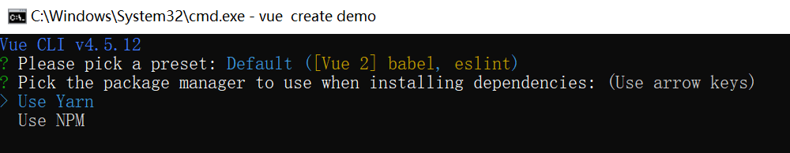
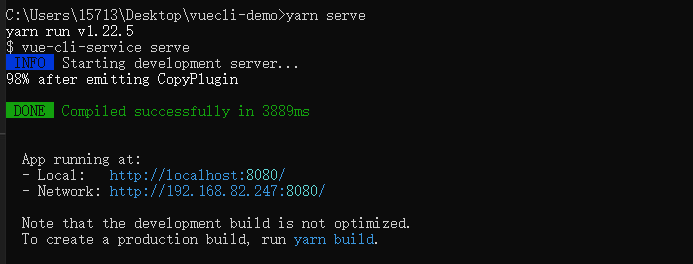
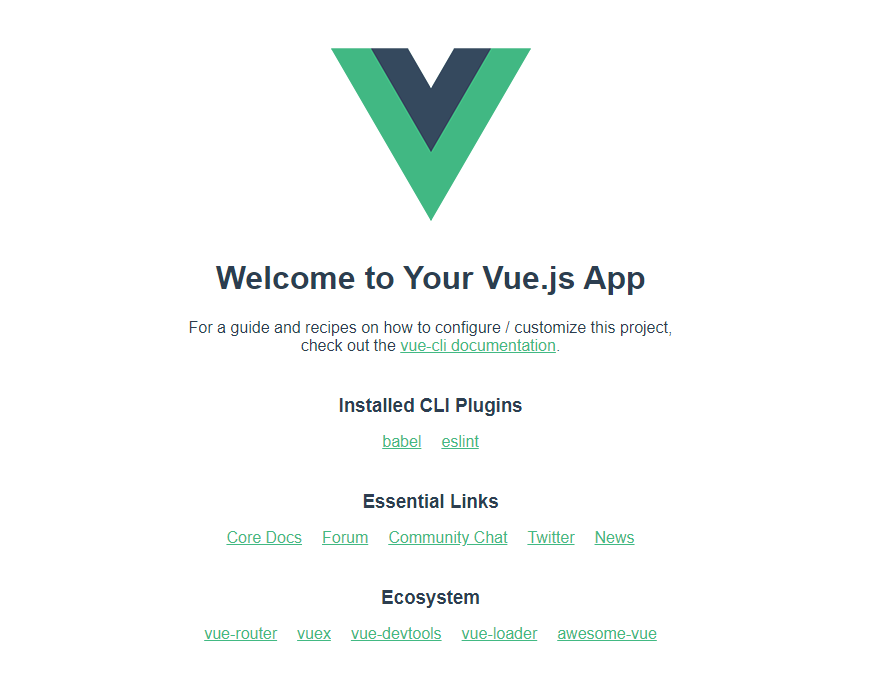
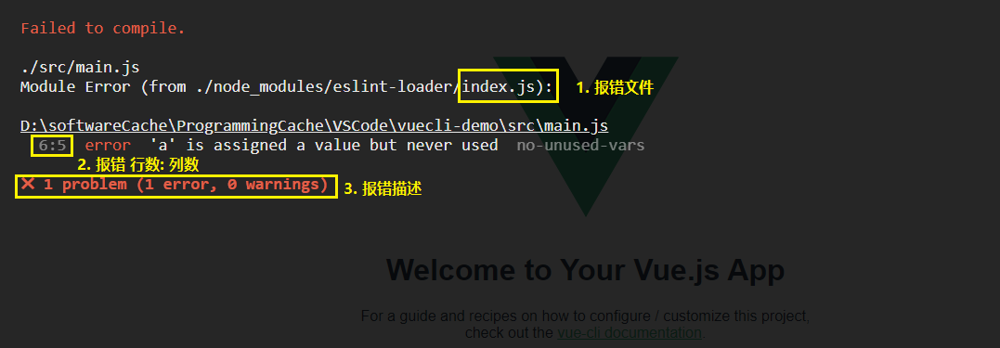
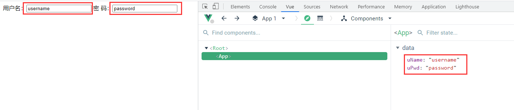
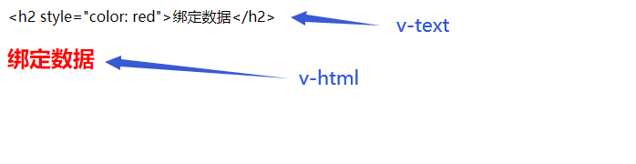
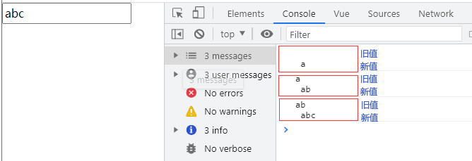
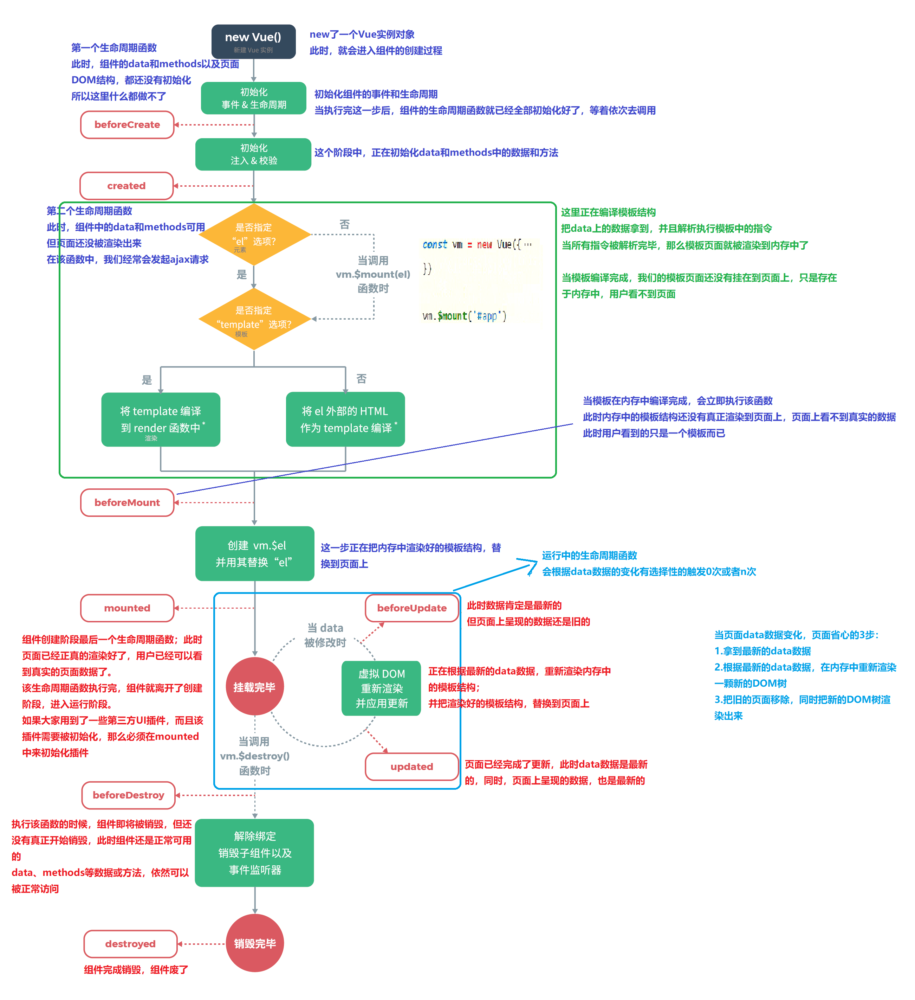

# 第十章：Vue

[Vue](https://cn.vuejs.org/)：渐进式javascript框架（库）

**Vue技术文档：https://fendteam.github.io/VueCourse** 

> 更少的时间，干更多的活。开发网站速度，快。

- 渐进式：声明式编程->组件化开发->客户端路由->大规模状态管理->前端工程化 
- 核心特性（方便我们写代码）
  - 数据响应式编程
  - 双向数据绑定
  - 组件化开发


## Vue 调试插件

Chrome插件：[Vue.js devtools](./assets/file/Chrome_Vue.js devtools.zip) 


## @vue/cli 脚手架

> webpack自己配置环境很麻烦，下载@vue/cli包，用vue命令创建脚手架项目。

@vue/cli 是 Vue 官方提供的一个全局模块包（得到vue命令）

### @vue/cli安装

```cmd
yarn global add @vue/cli
# 或
npm install -g @vue/cli
```

查看版本

```cmd
vue -V
```


### @vue-cli 创建项目

1. 创建项目

   > 项目名不能带大写字母，中文和特殊符号。

   ```cmd
   # 语法格式：
   vue create 项目名称
   # 实例：
   vue create vuecli-demo
   ```

2. 选择模板

   > 选择版本

   

   > 选择依赖包

   

3. 生成项目文件后，进入脚手架项目下，启动内置的热更新本地服务器。

   ```cmd
   cd vuecli-demo
   
   yarn serve
   # 或
   npm run serve
   ```

   看到绿色的，就启动成功了（底层 node + webpack 热更新服务）

   

4. 浏览器打开 `localhost:8080`，出现Vue 就说明启动成功了。

   

### @vue/cli 目录和代码分析

```cmd
vuecil-demo        # 项目目录
   ├── node_modules # 项目依赖的第三方包
   ├── public       # 静态文件目录
     ├── favicon.ico# 浏览器小图标
     └── index.html # 单页面的html文件(网页浏览的是它)
   ├── src          # 业务文件夹
     ├── assets     # 静态资源
       └── logo.png # vue的logo图片
     ├── components # 组件目录
       └── HelloWorld.vue # 欢迎页面vue代码文件 
     ├── App.vue    # 整个应用的根组件
     └── main.js    # 入口js文件
   ├── .gitignore   # git提交忽略配置
   ├── babel.config.js  # babel配置
   ├── package.json  # 依赖包列表
   ├── README.md    # 项目说明
   └── yarn.lock    # 项目包版本锁定和缓存地址
```

主要目录

```cmd
node_modules 下都是下载的第三方包
public/index.html – 浏览器运行的网页
src/main.js – webpack打包的入口文件
src/App.vue – vue项目入口页面
package.json – 依赖包列表文件
```


### @vue/cli 项目架构了解

main.js：项目打包入口 - Vue初始化

App.vue：Vue 页面主入口

index.html：浏览器允许的文件

执行流程：App.vue => main.js => index.html


### @vue/cli 自定义配置

src 同级目录新建 vue.config.js 配置文件

```js
/* 覆盖webpack配置 */
module.exports = {
    // 自定义服务配置
    devServer: {
        open: true,	// 自动打开浏览器
        port: 3000	// 自定义端口号，不建议更改
    }
}
```


### eslint 代码检查

> 代码检查工具。

在 mian.js 中声明变量，不要使用。 **运行服务后会报错，证明代码不严谨。** 

```js
import Vue from 'vue'
import App from './App.vue'

Vue.config.productionTip = false

// 定义变量
let a = 10;

new Vue({
  render: h => h(App),
}).$mount('#app')
```




#### 关闭代码校验

> 在 `vue.config.js` 中配置，默认 true 是开启，false 是关闭。

```js
module.exports = {
    // ...其他配置
    lintOnSave: false,
}
```


### @vue/cli 单vue文件讲解

> 推荐使用 .vue 文件来开发 vue 项目。

template里只能有一个根标签；

vue文件-独立模块-作用域互不影响；

style 配合 scoped 属性，样式只针对 当前 template 内标签生效。

结果：vue文件配合 webpack，把他们打包起来插入到 index.html，在浏览器运行。

```html
<!-- template必须, 只能有一个根标签, 影响渲染到页面的标签结构 -->
<template>
  <div>欢迎使用vue</div>
</template>

<!-- js相关 -->
<script>
export default {
  name: 'App'
}
</script>

<!-- 当前组件的样式, 设置scoped, 可以保证样式只对当前页面有效 -->
<style scoped>
</style>
```


### @vue/cli 清除欢迎界面

* src/App.vue 默认有很多内容，全部删除留下框
* assets 和 components 文件夹下的一切都删除掉 (不要默认的欢迎页面)


## Vue基本用法

前端核心：前后端交互（调用接口）；客户端渲染（把数据填充到标签里面）

> 数据绑定：把数据填充到标签的过程称为数据绑定。

### 外链式语法格式

```html
<body>
    <div id="info">
        {{msg}}
    </div>
    <script type="text/javascript" src="./lib/vue.js"></script>
    <script type="text/javascript">
        // 不需要显示的操作DOM元素
        new Vue({
            el: '#info',
            data: {
                msg: 'Hello Jerry'
            }
        })
    </script>
</body>
```

> new Vue：设置数据渲染的容器。
>
> el 和 data 属性名称是固定的（Vue 提供的 API）
>
> - el：id 选择器。
>
>   > 值也可以是一个 DOM 元素（不建议）
>
> - data：需要渲染的数据需要放在 data 中。

### .vue 文件语法格式

```vue
<template>
	<div>
    	标签内容
  	</div>
</template>

<script>
    export default {
        data() {
            // return 需要的数据
            return {
                key: value,
                key: value,
                ...
            }
        },
		methods: {
            方法名(形参) {
                // 方法体
            }
        }
    };
</script>

<style>
	/* 样式 */
</style>
```

> html 标签写在 template 下的 div 中。
>
> `export default`：
>
> `data(){ return{...} }`：需要渲染的数据放在 return{} 中。
>
> `methods(){}`：方法。


## 模板语法

> 基于 Vue 把数据填充到 HTML 标签的代码规则。


### MVVM 设计模式

> 用数据驱动视图改变，不需要进行 DOM 操作，挺高开发效率。
>
> 设计模式：是一套被反复使用的、多数人知晓的、经过分类编目的、代码设计经验的总结。

+ MVVM，一种软件架构模式，决定了写代码的思想和层次
  + M：   model数据模型          (data里定义)	
  + V：    view视图                   （html页面）
  + VM： ViewModel视图模型  (vue.js源码)

- MVVM通过 `数据双向绑定` 让数据自动地双向同步  **不再需要操作DOM**
  - V（修改视图） -> M（数据自动同步）
  - M（修改数据） -> V（视图自动同步）


### Vue 指令

> Vue 引入的自定义属性，都以 `v-` 开头。
>
> 指令的作用是由 Vue 提前设计好的，其本质是自定义属性。

```vue
<div data-id="123">图书</div>
<!-- 这些指令的作用是由Vue提前设计好的 -->
<div v-text></div>
```


### VM 

```vue
<script>
	const vm = new Vue({
        el: '#app',
        data: {
            msg: '我是一段信息'
        }
    })
</script>
```


==外链式在HTML文件内编写，但是需要链接 Vue.js 文件才可以使用。== 

### 插值表达式闪动问题

使用 `v-cloak` 指令解决插值表达式闪动问题，优化用户体验。

- **闪动解释：**插值表达式内容，在页面显示时，会先出现 `{}` 然后再替换为数据。

**指令 v-cloak 原理：**页面显示时，通过 v-cloak 指令对应的属性选择器将插值表达式隐藏（display:none），当数据替换之后，再显示。

```html
<!-- 1. 加上 v-cloak 指令 -->
<div id="app" v-cloak>
    {{msg}}
</div>

<style>
    /* 2. 根据v-cloak属性，写上一个隐藏样式 */
    [v-cloak]{
		display: none;
    }
</style>

<script>
    // 3. 当vue解析完成视图容器，去除v-cloak指令（属性）
    const vm = new Vue({
        el: '#app',
        data: {
            msg: '我是一段信息'
        }
    })
</script>
```


### v-on 指令

```vue
<a v-on:click="one" href="http://www.baidu.com"> 点击按钮 </a>
```


实际开发中，将 `v-on` 替换为 `@click` 。

有传参，手动传入 $event 对象

```vue
<a @click="one" href="http://www.baidu.com"> 点击按钮 </a>
<a @click="two(10, $event)" href="http://www.baidu.com"> 点击按钮 </a>

<script>
	export default {
        data () {
            return 1;
        },
        methods: {
            one (e) {
                e.preventDefault();
            },
            two (num, e) {
                e.preventDefault();
            }
        }
    }
</script>
```


#### 常用修饰符

|   事件   |                 说明                 |
| :------: | :----------------------------------: |
| .prevent |           阻止事件默认行为           |
|  .stop   |             阻止事件冒泡             |
|  .once   | 程序运行期间，只触发一次事件处理函数 |

```vue
<!-- 语法格式： -->
<a @click.修饰符="函数名">按钮</a>
```

```vue
<a @click.prevent="one" href="http://www.baidu.com"> 阻止默认行为 </a>

<div class="father">
    <div @click.stop="one" class="son"> 阻止儿子冒泡 </div>
</div>

<button @click.once="one"> 只执行一次 </button>


<script>
	export default {
        methods: {
            one (e) {
                e.preventDefault();
            }
        }
    }
</script>
```


#### 键盘事件

```vue
<input type="text" @keydown.按键修饰符="函数名" >
```


| 常用修饰符 |     说明      |
| :--------: | :-----------: |
|   .enter   | 按下 enter 键 |
|    .esc    |  按下 esc 键  |

```vue
<input type="text" @keydown.enter="enterFn">
<input type="text" @keydown.esc="escFn">
```


#### 案例：反转字符串

```vue
<template>
	<div>
        <p>{{msg}}</p>
        <button @click="reverseFn()">点击反转</button>
    </div>
</template>

<script>
    export default {
        data() {
            return {
                msg: "Hello,World",
            }
        },
        methods: {
            // 定义反转方法
            reverseFn () {
                this.msg = this.msg.split('').reverse().join('');
            }
        },
    };
</script>
```


### v-once指令

> 如果显示的信息后续不需要再修改，使用v-once，这样可以提高性能。
>
> 简单理解：定义它的元素或组件只会渲染一次，包括元素或者组件的所有字节点。首次渲染后，不再随着数据的改变而重新渲染。也就是说使用v-once，那么该块都将被视为静态内容。

```vue
<div id="app">
  <div v-once>{{msg}} 只想渲染一次</div>
  <div>{{msg}} 数据变化就有更新</div>
</div>

<script>
export default {
    data () {
        return () {
            msg: '我是一段信息'
        }
    }
}
</script>
```


### v-pre指令

> 跳过这个元素和它的子元素的编译过程，如果跳过某些标签的编译过程，会提高性能，可以显示原始的信息。v-pre指令

```vue
<!-- v-pre的作用：防止内部的内容被编译 -->
<span v-pre>{{ msg }}</span>

<script>
export default {
    data () {
        return () {
            msg: 'message'
        }
    }
}
</script>
```

==使用v-pre之前，显示原数据的值：message，使用v-pre之后，会显示：{{ msg }}== 


### v-model 双向绑定

数据双向绑定。

> 语法糖，相当于 :value 和 @input 两段代码。

==v-model 只能作用在 input 表单上。== 

```vue
<template>
	<div>
    	用户名：<input type="text" v-model="uName">
    	密  码：<input type="text" v-model="uPwd">
	</div>
</template>

<script>
    export default {
        data() {
            return {
                uName: '',
                uPwd: '',
            }
        }
    };
</script>
```



#### v-model 方法

| 方法名  | 说明                   |
| ------- | ---------------------- |
| .number | 转成数值类型再进行存储 |
| .trim   | 去除前后空格           |
| .lazy   | 等回车后再收集数据     |

```vue
<template>
	<div>
        年龄：
    	<input type="number" v-model.number="age">
        
        自我介绍：
    	<textarea cols="30" rows="10" v-model.trim="area"></textarea>
    </div>
</template>


<script>
	export default {
        data () {
            return {
                age: '',
                area: '',
            }
        }
    }
</script>
```


#### 注意事项

- 下拉菜单 select
  - value 写在 option 上
  - v-model 写在 select 上
- 复选框 checkbox，v-model 的变量（推荐 数组）
  - 非数组：关联的是 checked 属性
  - **数    组：关联的是 value 属性** 

vue 变量的初始值会影响表单的默认状态，因为双线数据绑定 - 互相影响。

```vue
<template>
	<div>
        地区：
        <select v-model="form">
            <option value="河南">河南</option>
            <option value="北京">北京</option>
            <option value="上海">上海</option>
            <option value="深圳">深圳</option>
        </select>

        爱好：
        <input type="checkbox" v-model="hobby" value="跑步"> 跑步
        <input type="checkbox" v-model="hobby" value="听歌"> 听歌
        <input type="checkbox" v-model="hobby" value="敲代码"> 敲代码

        性别：
        <input type="radio" v-model="sex" value="男"> 男
        <input type="radio" v-model="sex" value="女"> 女
  </div>
</template>

<script>
    export default {
        data() {
            return {
                // 下拉列表
                form: '',
                // 复选框
                hobby: [],
                // 单选框
                sex: '',
            }
        },
    };
</script>
```


### 数据绑定指令

- v-text 显示纯文本

  > 把data中的普通文本数据绑定到HTML标签里面。

- v-html 显示富文本（解析样式）

  >把data中的富文本数据绑定到HTML标签里面并且解析样式。

```vue
<template>
	<div>
    <div v-text="info"></div>
    <div v-html="info"></div>
  </div>
</template>

<script>
  export default {
    data () {
      return {
        info: '<h2 style="color: red">v-html绑定数据</h2>'
      }
    }
  }
</script>
```




### 属性绑定指令

```html
<!-- 语法格式 -->
v-bind：属性名称 = 属性值（来源于 data 中的数据）
```

```html
<a id="app" v-bind="hrefUrl">动态链接地址</a>

<script>
	const vm = new Vue({
        el: '#app',
        data: {
            hrefUrl: 'http://itcast.cn'
        }
    })
</script>
```

简写

```html
<a :href="hrefUrl">链接地址</a>
```

字符串拼接

```html
<a :href="'http://localhost:8080/' + path">测试</a>
```


### 样式动态绑定

#### 动态绑定 class 属性

:class=“绑定的值” 要求：对象类型 数组类型

1. 给 `:class` 属性绑定对象，对象中是键值对 {key: value}

   > key 是类的名称，Value 是布尔类型：true 添加类，false 移出类。
   >
   > 如果需要操作多个类，对象类可以写多个键值对。

   ```html
   <div id="app">
       <div :class="{active: isShow, bg: hasBg}"> 测试 class 样式-对象 </div>
   </div>
   ```

2. 给 `:class` 属性绑定数组，[类名1, 类名2]

   ```html
   <div id="app">
       <div :class="['active', 'bg']"> 测试 class 样式-数组 </div>
   </div>
   ```

3. class 静态属性：`class` 属性是可以共存，`:class` 绑定的类可以叠加。

   ```html
   <div class="abc" :class="['active', {bg: hasBg}]"> 测试 class 样式 </div>
   ```

4. 通过 data 中定义好的信息进行绑定。

   ```html
   <div :class="{active: isShow, bg: hasbg}"> 测试 </div>
   <div :calss="obj"> 测试 </div>
   
   <div :class="['active', 'bg']"> 测试 </div>
   <div :class="list"> 测试 </div>
   
   <script type="text/javascript">
   	new Vue({
           el: '#app',
           data: {
               msg: 'hello',
               isShow: true,
               flag: false,
               hasBg: true,
               obj: {active: true, bg: true},
               list: ["active", "bg", "abc"]
           }
       })
   </script>
   ```


#### 动态绑定 style 属性

- style 的值比较特殊，使用 `:style="值"` ，值：对象 / 数组。
- ==key 就是 css 的属性名，value 就是 css的属性值。== 

1. 对象方式：

   > key 如果不加引号，需要遵循驼峰命名法。

   ```html
   <div id="app" :style="styleObject"> v-bind 绑定style属性-对象 </div>
   
   <script type="text/javascript">
   	new Vue({
           el: "#app",
           data: {
               styleObject: {
                   fontSize: '16px',
                   "line-height": '16px'
               }
           }
       })
   </script>
   ```

2. 数组方式：

   > [item1, item2, ...]，指的是对象 {key:value}

   ```html
   <div id="app" :style="styleArray"> v-bind 绑定style属性-数组 </div>
   
   <script type="text/javascript">
   	new Vue({
           el: "#app",
           data: {
               styleArray: [
                   {fontSize: '16px'},
                   {backgroundColor: 'pink'}
               ]
           }
       })
   </script>
   ```


### 条件渲染指令

1. 控制标签添加和移出

   - v-if	v-else	v-else-if

   ```html
   <div v-if="gender === 1"> 男 </div>
   <div v-else-if="gender === 2"> 女 </div>
   <div v-else> 不确定 </div>
   ```

2. 控制标签显示和隐藏

   ```html
   <div v-show="isShow"> v-show指令 </div>
   ```

**v-show 和 v-if 之间的区别** 

- v-show：控制标签样式 display
- v-if：控制标签的添加和移出，这种DOM 操作比较耗时。

==如果要频繁控制显示和隐藏，推荐使用 v-show，性能更好。== 


#### 安装 less 模块

```cmd
yarn add less@3.0.4 less-loader@5.0.0 -D
```


#### 案例：点击隐藏列表

```vue
<template>
<div>
    <div class="box">
        <div class="title">
            <h3>
                标题
                <span class="btn" @click="isShow = !isShow">按钮</span>
            </h3>
            
        </div>
        <div class="content" v-show="isShow">
            <p>列表1</p>
            <p>列表2</p>
            <p>列表3</p>
            <p>列表4</p>
        </div>
    </div>
</div>
</template>

<script>
  export default {
    data () {
        return {
            isShow: true,
        }
    }
  }
</script>

<style lang="less" scoped>
    * {margin: 0; padding: 0;}
    .box {
        width: 200px;
        border: 1px solid #333;

        .title {
            height: 30px;
            line-height: 30px;

            .btn {
                font-size: 14px;
                font-weight: 400;
            }
        }
        
        .content {
            border-top: 1px solid #333;

            p {
                line-height: 24px;
            }
        }
    }
</style>
```


### v-for 列表渲染指令

1. 不依赖数据，直接遍历 4 次。

   > i 是变量，从 1 开始的序号。

   ```html
   <ul>
       <li v-for="i in 4">{{i}}</li>
   </ul>
   ```

2. 依赖 data 中的数据 数组。

   > item：变量，遍历 list 中的每一项数据。
   >
   > in 是固定写法。
   >
   > list：data 中声明的数据，类型（数组|对象）。

   ```html
   <ul>
       <li v-for="item in list"> {{item}} </li>
   </ul>
   ```

3. 依赖 data 中的数据 数组 获取索引

   ```html
   <ul>
       <li v-for="(item, i) in list"> {{item}} </li>
       <li v-for="item in listObj"> {{item.id + ":" + item.uname}} </li>
   </ul>
   
   <script>
   	new Vue({
           el: "#app",
           data: {
               listObj: [
                   {id: 1, uname: 'tom'},
                   {id: 2, uname: 'jerry'},
                   {id: 3, uname: 'rose'}
               ]
           }
       })
   </script>
   ```

4. 依赖 data 中的数据 对象 获取键值

   ```html
   <ul>
       <li v-for="(v, k, i) in obj"> 键：{{k}}--->值：{{v}}--->索引：{{i}} </li>
   </ul>
   ```

   使用 v-for 的时候，有个规范和约定，遍历处理的每一个元素，最后使用 `:key` 属性进行标识。

   > `:key` 进行唯一标识，保证数据不重复。

   ```html
   <li :key="item.id" v-for="item in listObj">{item.uname}</li>
   ```

   ==在vue中，for in 和 for of 的使用没有区别。== 


#### 案例：走一走

```vue
<template>
  <div>
    <ul>
      <li :key="index" v-for="(item, index) in list">{{item}}</li>
    </ul>
    <button class="btn" @click="btn()">点击</button></div>
  </div>
</template>

<script>
  export default {
      // 数据
      data () {
        return {
          list: ['张三', '李四', '王五', '赵六'],
        }
      },

      // 方法
      methods: {
        btn() {
          // 添加一项到最后
          this.list.push(this.list[0]);
          // 删除当前第一项
          //this.list.shift();
          this.list.splice(0, 1);
        }
      }
  }
</script>
```


### 案例：图书管理


### 数组方法注意事项

`push()`、`pop()`、`shift()`、`unshift()`、`splice()`、`sort()`、`reverse()` 会修改原数组的值。

`filter()`、`concat()`、`slice()` 不会更新原数组的值。


- 数组变更方法，就会导致v-for 更新，页面更新。
- 数组非变更方法，返回新数组，就不会导致 v-for 更新，可采用覆盖数组或 `this.$set()`。

```vue
<template>
  <div>
    <ul>
      <li :key="i" v-for="(v, i) in arr">{{v}}</li>
    </ul>
    <button @click="update()">点击更改第二个值</button>
  </div>
</template>

<script>
  export default {
    // 数据
    data () {
      return {
        arr: ['张三', '李四', '王五', '赵六'],
      }
    },

    // 方法
    methods: {
      update() {
        this.$set(this.arr, 1, "刘亦菲");
      }
    }
  }
</script>

<style scoped>
  
</style>
```


## 虚拟 DOM

本质就是一个 JS 对象，保存 DOM关键信息。

> 在内存中比较变化部分，不会比较真实(整个)DOM 树，提高 DOM 更新的性能。


diff 算法

同级比较，删除重新建立整个DOM树，DOM复用, 只更新属性。


无 key

最大限度尝试就地修改 / 复用相同类型元素


有 key，值为索引

有key属性，基于 key 的来比较新旧虚拟DOM，移除key不存在元素。


有 key，值为id


## 过滤器 filter

转换格式，过滤器就是一个**函数**，传入值返回处理后的值。

过滤器只能用在 ==插值表达式和 v-bind 表达式==。

### 语法

```vue
<!-- 全局过滤器 -->
Vue.filter("过滤器名称", 值 => {
	return "返回处理后的值"
});

<!-- 局部过滤器 -->
filters: {过滤器名称: (值) => {
	return "返回处理后的值"
}};
```

全局过滤器要写在 main.js 中。

```vue
Vue.filter("toUp", => {
	return ''
})
```

局部过滤器

> msg | reverseFilter()：msg 作为实参传给 reverseFilter() 
>
> ('|') 作为第二个实参传给 reverseFilter() 

```vue
<template>
  <div>
    <p>{{ msg | reverseFilter('|') }}</p>
    <p :title="msg | toUp()">鼠标悬停：{{msg}}</p>
  </div>
</template>

<script>
export default {
  // 数据
  data () {
    return {
      msg: "Hello World",
    }
  },

  // 过滤器
  filters: {
    reverseFilter (str, s) {
      return str.split('').reverse().join('s');
    },

    toUp (str) {
      return str.toUpperCase();
    }
  }
}
</script>
```


### 传参和多过滤器

可同时使用多个过滤器，或者给过滤器传参。

#### 语法

```vue
过滤器传参：vue变量 | 过滤器(实参)
多个过滤器：vue变量 | 过滤器1 | 过滤器2
```


反转字符串 + 转大写

```vue
<template>
  <div>
    <p>{{ msg | reverseFilter() | toUp() }}</p>
    <p :title="msg | toUp()">鼠标悬停：{{msg}}</p>
  </div>
</template>

<script>
export default {
  // 数据
  data () {
    return {
      msg: "Hello World",
    }
  },

  // 过滤器
  filters: {
    reverseFilter (str) {
      return str.split('').reverse().join('');
    },

    toUp (str) {
      return str.toUpperCase();
    }
  }
}
</script>
```

> 过滤器可以传参，还可以对某个过滤器结果，后面在使用一个过滤器。


### moment 模块（时间格式化）

moment 官网文档：http://momentjs.cn/docs/#/displaying/

1. 安装 moment 处理时间第三方模块

   ```cmd
   yarn add moment -D
   ```

2. 定义过滤器，把时间格式化

   ```vue
   <template>
     <div>
       <!-- 未转换的时间格式 -->
       <p>{{time}}</p>
       <!-- 转换后的时间格式 -->
       <p>{{time | formatDate()}}</p>
     </div>
   </template>
   
   <script>
   // 导入 moment
   import moment from 'moment'
   
   export default {
     // 数据
     data () {
       return {
         time: new Date(),
       }
     },
   
     // 过滤器
     filters: {
       formatDate (date) {
         return moment(date).format('YYYY-MM-DD');
       }
     }
   }
   </script>
   ```

   

## computed 计算属性

当变量的值，需要通过计算得到，可以使用 computed。

> 注意：
>
> data() 中的变量不能和 computed 中的变量名重复。

### 语法

> 这种写法相当于触发了 get() 方法，详细看完整写法。

```js
computed: {
   变量名 () {
      return 返回值;
   },
}
```

```vue
<template>
  <div>
    {{num}}
  </div>
</template>

<script>
export default {
  // 数据
  data () {
    return {
      a: 10,
      b: 20
    }
  },

  // 计算属性
  computed: {
    num () {
      return  this.a + this.b;
    }
  }
}
</script>
```


### 计算属性 - 缓存

计算属性，基于依赖项的值进行缓存，依赖的变量不变，都直接从缓存取结果。

- **简单理解：同一方法只调用一遍，再次调用方法时，则从缓存中读取结果。** 

**好处：** 

1. 带缓存。
2. 依赖项不变，直接从缓存读取。
3. 依赖项改变，函数自动执行，并重新缓存。


### 计算属性 - 完整写法

计算属性也是变量，如果想要直接赋值，需要使用完整写法。

> set：写，get：读

#### 语法

```js
computed: {
   "属性名": {
      set(值) {
         
      },
      get() {
         return "值";
      }
   }
}
```


#### 案例：全选反选

```vue
<template>
  <div>
    <span>全选:</span>
    <input type="checkbox" v-model="isAll" />
    <button @click="invert">反选</button>
    <ul>
      <li v-for="v in arr" :key="v">
        <input type="checkbox" v-model="v.c" />
        <span>{{v.name}}</span>
      </li>
    </ul>
  </div>
</template>

<script>
export default {
  // 数据
  data () {
    return {
      arr: [
        { name: "猪八戒", c: false, },
        { name: "孙悟空", c: false, },
        { name: "唐僧", c: false, },
        { name: "白龙马", c: false, }
      ]
    }
  },
  // 方法
  methods: {
    // 反选影响单选
    invert () {
      this.arr.forEach(item => item.c = !item.c);
    }
  },
  // 计算属性
  computed: {
    /* 全选按钮 */
    isAll: {
      set (val) {
        // 全选影响单选
        this.arr.forEach((item) => item.c = val);
      },
      get () {
        // 单选影响全选
        return this.arr.every((item) => item.c);
      }
    },
  }
}
</script>
```


## 侦听器 watch

监听 data / computed 属性值的改变。

### 语法

> newVal：最新的值，oldVal：上一次的值。

```js
watch: {
    "被监听的属性名": (newVal, oldVal) {
        
    }
}
```

### 监听基本类型

```vue
<template>
  <div>
    <input type="text" v-model="name">
  </div>
</template>

<script>
export default {
  // 数据
  data () {
    return {
      name: ''
    }
  },
  // 监听器
  watch: {
    name (newVal, oldVal) {
      console.log(oldVal, "\n", newVal);
    }
  }
}
</script>
```




### 监听复杂类型

#### 语法

> immediate立即侦听，deep深度侦听，handler固定方法触发

```js
watch: {
    "要侦听的属性名": {
        immediate: true,	// 立即执行
        deep: true,		// 深度侦听复杂类型内变化
        handler (newVal, oldVal) {
            
        }
    }
}
```


### 数据缓存 - 使数据持久化存储

- 本地存储

  ```js
  localStorage.setItem("new",JSON.Stringify(old));
  ```

  

## Vue 组件

组件是 **可复用的 Vue 实例，封装标签，样式和 JS 代码。** 

- 组件化 ：封装的思想，把页面上 `可重用的部分` 封装为 `组件`，从而方便项目的 开发 和 维护。

> 简单理解：一个页面， 可以拆分成一个个组件，一个组件就是一个整体，每个组件可以有自己独立的 结构 样式 和 行为 (html, css和js)


### 组件的创建使用

创建组件：创建.vue文件 – 标签 – 样式 – JS进去

注册组件：（全局 / 局部）

使用组件：（组件名用作标签）

> 执行结果：把组件标签最终替换成封装组件内的标签。


1. 创建组件 (components 下的 Pannel.vue)

   ```vue
   <template>
     <div>
       <div>
         <div class="title">
           <h4>芙蓉楼送辛渐</h4>
           <span class="btn" @click="isShow = !isShow">
             {{ isShow ? '收起' : '展开' }}
           </span>
         </div>
         <div class="container" v-show="isShow">
           <p>寒雨连江夜入吴, </p>
           <p>平明送客楚山孤。</p>
           <p>洛阳亲友如相问，</p>
           <p>一片冰心在玉壶。</p>
         </div>
       </div>
     </div>
   </template>
   
   <script>
   export default {
     // 数据
     data () {
       return {
         isShow: false
       }
     }
   }
   </script>
   
   <style lang="less" scoped>
     .title {
       display: flex;
       justify-content: space-between;
       align-items: center;
       border: 1px solid #ccc;
       padding: 0 1em;
       }
       .title h4 {
       line-height: 2;
       margin: 0;
       }
       .container {
       border: 1px solid #ccc;
       padding: 0 1em;
       }
       .btn {
       /* 鼠标改成手的形状 */
       cursor: pointer;
       }
   </style>
   ```

2. 局部注册组件，并使用 (App.vue)

   ```vue
   <template>
     <div id="app">
       <h3>案例：折叠面板</h3>
       <!-- 3.使用组件 -->
       <pannel></pannel>
       <pannel></pannel>
       <pannel></pannel>
     </div>
   </template>
   
   <script>
   // 2. 注册组件
   import Pannel from './components/Pannel'
   export default {
     components: {
       Pannel
     },
   }
   </script>
   
   <style lang="less" scoped>
     body {
       background-color: #ccc;
       #app {
         width: 400px;
         margin: 20px auto;
         background-color: #fff;
         border: 4px solid blueviolet;
         border-radius: 1em;
         box-shadow: 3px 3px 3px rgba(0, 0, 0, 0.5);
         padding: 1em 2em 2em;
         h3 {
           text-align: center;
         }
       }
     }
   </style>
   ```


### Vue 组件通信

App.vue

```vue
<template>
	<div>
    <!-- 传入数据 -->
    <MyProduct title="俺是标题" price="100" info="俺是描述，这玩意儿真不错"></MyProduct>
  </div>
</template>

<script>
// 引入子组件
import MyProduct from './components/MyProduct.vue'

export default {
  // 注册组件
  components: {
    MyProduct,
  },
};
</script>
```

MyProduct.vue

```vue
<template>
	<div class="my-product">
		<h3>标题: {{ title }}</h3>
		<p>价格: {{ price }}元</p>
		<p>{{ info }}</p>
	</div>
</template>

<script>
export default {
	props: ["title", "price", "info"],
};
</script>

<style scoped>
.my-product {
	width: 400px;
	padding: 20px;
	border: 2px solid #000;
	border-radius: 5px;
	margin: 10px;
}
</style>
```


#### 父向子 - props

指定类型，是否必传

```vue
props: {
	title: {
    	typeof: String,
    	require: true
    },
}
```


#### 父向子 - 组件循环


App.vue

```vue
<template>
  <div>
    <MyProduct v-for="v in list"
              :title="v.proname"
              :price="v.proprice"
              :info="v.info"
              :key="v.id">
    </MyProduct>
  </div>
</template>

<script>
import MyProduct from './components/MyProduct.vue'

export default {
  // 数据
  data () {
    return {
      list: [
          { id: 1, proname: "超级好吃的棒棒糖", proprice: 18.8, info: '开业大酬宾, 全场8折' },
          { id: 2, proname: "超级好吃的大鸡腿", proprice: 34.2, info: '好吃不腻, 快来买啊' },
          { id: 3, proname: "超级无敌的冰激凌", proprice: 14.2, info: '炎热的夏天, 来个冰激凌了' },
      ],
    }
  },
  // 注册组件
  components: {
    MyProduct,
  }
}
</script>
```

MyProduct.vue

```vue
<template>
	<div class="my-product">
		<h3>标题: {{ title }}</h3>
		<p>价格: {{ price }}元</p>
		<p>{{ info }}</p>
	</div>
</template>

<script>
export default {
	props: ["title", "price", "info"],
};
</script>

<style scoped>
.my-product {
	width: 400px;
	padding: 20px;
	border: 2px solid #000;
	border-radius: 5px;
	margin: 10px;
}
</style>
```


#### 子向父

> 单项数据流
>
> 简单理解：父组件向子组件发送事件，子组件触发。

触发父组件的自定义方法

```js
this.$emit("", 参数1, 参数2);
```


#### EventBus（兄弟通信）

> 跨组件通信使用。
>
> 在监听方（List）接收，发送方（MyProduct）发送。

1. 在 App.vue 父组件中写主体代码

   ```vue
   <template>
     <div>
       <div style="float: left;">
         <Product v-for="(v, i) in list" :key="v.id"
           :title="v.proname"
           :price="v.proprice"
           :info="v.info"
           :index="i">
         </Product>
       </div>
   
       <div style="float: left;">
         <List :arr="list"></List>
       </div>
   
     </div>
   </template>
   
   <script>
   // 1.导入组件
   import Product from './components/MyProduct.vue'
   import List from './components/List.vue'
   
   export default {
     // 2.注册组件
     components: {
       Product,
       List
     },
     // 数据
     data () {
       return {
         price: 1,
         list: [
           {id: 1, proname: "超级好吃的棒棒糖", proprice: 18.8, info: "开业大酬宾, 全场8折",},
           {id: 2, proname: "超级好吃的大鸡腿", proprice: 34.2, info: "好吃不腻, 快来买啊",},
           {id: 3, proname: "超级无敌的冰激凌", proprice: 14.2, info: "炎热的夏天, 来个冰激凌了",},
         ],
       }
     },
   }
   </script>
   ```

2. 在 MyProduct.vue 外部组件中使用

   ```vue
   <template>
   	<div class="my-product">
   		<h3>标题: {{ title }}</h3>
   		<p>价格: {{ price }}元</p>
   		<p>{{ info }}</p>
       	<button @click="subFn">宝刀-砍1元</button>
   	</div>
   </template>
   
   <script>
   import eventBus from '../EventBus/index.js'
   
   export default {
   	props: ["title", "price", "info", "index"],
   	methods: {
   		subFn () {
   			// 发送
   			eventBus.$emit('subPrice', this.index, 1);
   		}
   	}
   };
   </script>
   
   <style scoped>
   .my-product {
   	width: 400px;
   	padding: 20px;
   	border: 2px solid #000;
   	border-radius: 5px;
   	margin: 10px;
   }
   </style>
   ```

3. 在 src 下创建 EventBus 文件夹，下新建 index.js，并创建空白 Vue 对象并导出 （只负责监听和触发）

   ```js
   import Vue from 'vue'
   export default new Vue();
   ```

4. 在 components 文件夹下新建 List.vue 

   > 箭头函数没有 this，可以直接指向

   ```vue
   <template>
   	<div>
   		<ul class="my-product">
   			<li v-for="(item, index) in arr" :key="index">
   				<span>{{ item.proname }}</span>
   				<span>{{ item.proprice }}</span>
   			</li>
   		</ul>
   	</div>
   </template>
   
   <script>
   import eventBus from "../EventBus/index.js";
   
   export default {
   	props: ["arr"],
   	// 生命周期 函数  vue创建完毕以后调用created
   	// 	created ：处于loading结束后，还做一些初始化，实现函数自执行（data数据已经初始化，但是DOM结构渲染完成，组件没有加载）
   	// 	mounted ：处于发起后端请求，获取数据，配合路由钩子执行操作（DOM渲染完成，组件挂载完成 ）
   	created() {
   		// 接收(监听)
   		eventBus.$on("subPrice", (index, price) => {
   			if (this.arr[index].proprice > 1) {
   				this.arr[index].proprice = (this.arr[index].proprice - price).toFixed(2);
   			}
   		});
   	},
   };
   </script>
   
   <style scoped>
   .my-product {
   	width: 400px;
   	padding: 20px;
   	border: 2px solid #000;
   	border-radius: 5px;
   	margin: 10px;
   }
   </style>
   ```


#### 传数据注意事项

数据在父组件中，修改父组件数据时

- 如果数据类型是一般类型，要在父组件中修改
- 如果数据类型的复杂类型，可以直接在自组件中修改

==因为指针问题，复杂类型访问的是指针。不**管是什么类型的数据，都推荐在父组件中修改数据。**==  


#### 套娃通信

> 套娃过程中，要一层一层的数据传递。


### 案例：Todo 备忘录

[Todo案例完成参考.zip](./assets/file/case/Vue-todo案例.zip) 

1. 创建工程和组件

   > 创建组件 todoHeader.vue、todoMain.vue、todoFooter.vue

   todoHeader.vue

   ```vue
   <template>
     <header class="header">
       <h1>todos</h1>
       <input id="toggle-all" class="toggle-all" type="checkbox" >
       <label for="toggle-all"></label>
       <input
         class="new-todo"
         placeholder="输入任务名称-回车确认"
         autofocus
       />
     </header>
   </template>
   
   <script>
   export default {
    
   }
   </script>
   ```

   todoMain.vue

   ```vue
   <template>
     <ul class="todo-list">
       <!-- completed: 完成的类名 -->
       <li class="completed" >
         <div class="view">
           <input class="toggle" type="checkbox" />
           <label>任务名</label>
           <button class="destroy"></button>
         </div>
       </li>
     </ul>
     
   </template>
   
   <script>
   export default {
       
   }
   </script>
   ```

   todoFooter.vue

   ```vue
   <template>
     <footer class="footer">
       <span class="todo-count">剩余<strong>数量值</strong></span>
       <ul class="filters">
         <li>
           <a class="selected" href="javascript:;" >全部</a>
         </li>
         <li>
           <a href="javascript:;">未完成</a>
         </li>
         <li>
           <a href="javascript:;" >已完成</a>
         </li>
       </ul>
       <button class="clear-completed" >清除已完成</button>
     </footer>
   </template>
   
   <script>
   export default {
   
   }
   </script>
   ```

   

2. 导入组件和样式

   App.vue

   ```vue
   <template>
     <div class="todoapp">
       <TodoHeader></TodoHeader>
       <TodoMain></TodoMain>
       <TodoFooter></TodoFooter>
     </div>
   </template>
   
   <script>
   import './styles/base.css'
   import './styles/index.css'
   import TodoHeader from './components/todoHeader.vue'
   import TodoMain from './components/todoMain.vue'
   import TodoFooter from './components/todoFooter.vue'
   
   export default {
     components: {
       TodoHeader,
       TodoMain,
       TodoFooter
     },
   }
   </script>
   ```


## Vue 生命周期

> Vue 实例创建到销毁的整个过程。

### 钩子函数

**Vue 框架内置函数，随着组件的生命周期阶段，自动执行。** 

> 可以知道 Vue 声明周期到达了哪个阶段。

- 作用：特定的时间点，执行特定的操作。

- 场景：组件创建完成后，可以在 created 生命周期函数中发起 Ajax 请求，从而初始化 data 数据。

- 四个阶段：初始化、挂载、更新、销毁。
  - **在before... 时，都是在内存中执行的。** 


#### 初始化

- beforecreate : 一般使用场景是在加 loading 事件 的时候。
- created ：处于loading 结束后，还做一些初始化，实现函数自执行（data数据已经初始化，但是DOM结构渲染完成，组件没有加载）。

#### 挂载

- beforemount：处于组件创建完成，但未开始执行操作。
- mounted ：处于发起后端请求，获取数据，配合路由钩子执行操作（DOM渲染完成，组件挂载完成 ）。

#### 更新

- beforeupdate、updated：处于数据更新的前后。

#### 销毁

> 一般用作清除定时器。

- beforeDestroy：当前组件还在的时候，想删除组件。
- destroyed ：当前组件已被销毁，清空相关内容 。


### 生命周期

| 阶段   | 方法名        | 方法名    |
| ------ | ------------- | --------- |
| 初始化 | beforeCreate  | created   |
| 挂载   | beforeMount   | mounted   |
| 更新   | beforeUpdate  | updated   |
| 销毁   | beforeDestroy | destroyed |


### 执行过程

 

App.vue

```vue
<template>
  <div>
      <Life v-if="isShow == true"></Life>
      <button @click="isShow = false">点击销毁组件</button>
  </div>
</template>

<script>
import Life from './components/life.vue'

export default {
  data () {
    return {
      isShow: true,
    }
  },
  components: {
    Life,
  },
}
</script>
```

Life.vue

```vue
<template>
  <div id="myApp">
    {{ msg }}
    <button @click="msg = 'Hello Vue'">点击修改msg的值</button>
  </div>
</template>

<script>

export default {
  data () {
    return {
      msg: 'Hello World'
    }
  },
  
  /* 初始化阶段：在Vue实例创建完成之前触发，
      这时候还没有初始化data中的数据以及methods中的方法
   */
  beforeCreate () {
    console.log('beforeCreate执行了');
    
    console.log(this.msg, 'msg');   // undefined
  },

  /* 初始化阶段：
      这时候data中的数据初始化完成，但是拿不到真实dom
   */   
  created () {
    console.log('created执行了');

    console.log(this.msg, 'msg');   // Hello World
    console.log( document.querySelector('#myApp'), '#myApp');   // null

    // 测试销毁组件：销毁定时器
    //  因为本质是对象，可以使用this.创建属性
    this.timeId = setInterval(function() {
      console.log(1);
    }, 1000);
  },

  /* 挂载阶段：将 template模板中的内容在内存中编译完成，会立即执行函数，
      内存中的模板结构还没有真正渲染到页面上，所以看不到真实的数据，只能看到一个模板。
   */
  beforeMount () {
    console.log('beforeMount执行了');

    console.log( document.querySelector('#myApp'), '#myApp');   // null
  },

  /* 挂载阶段：把内存中渲染好的模板结构替换到页面上。
      能获取真实dom。
   */
  mounted () {
    console.log('mounted执行了');

    console.log( document.querySelector('#myApp'), '#myApp');   // <div id="myApp">···</div>
  },

  /* 更新阶段：数据的最新的，但是页面呈现的数据还是旧的。
  */
  beforeUpdate () {
    console.log('beforeUpdate执行了');

    console.log(this.msg, 'this.msg');  // Hello Vue
  },

  /* 更新阶段：页面完成更新，data中的数据和页面的数据都是最新的。
      可以获取最新的dom元素。
   */
  updated () {
    console.log('updated执行了');

    console.log(this.msg, 'this.msg');   // Hello Vue
    console.log( document.querySelector('#myApp') );  // 最新的dom
  },

  /* 销毁阶段：
   */
  beforeDestroy () {
    console.log('beforeDestroy执行了');
  },

  /* 销毁阶段：可以清理定时器，清理事情绑定。
   */
  destroyed () {
    console.log('destroyed执行了');

    // 销毁定时器
    clearInterval(this.timeId);
  },
}
</script>
```


#### 总结

- ##### 初始化

  在Vue实例创建完成之前触发，还**没有初始化data中的数据以及methods中的方法**。

  **可以在这里 最早发起 Ajax 请求，从而初始化 data 数据。** 

  > .vue 中写的是虚拟dom，.html 中的标签都是真实dom。
  >
  > 好处：虚拟dom只更新更改的dom属性，不会遍历所有的属性，更快，更节省性能。

- ##### 挂载

  将 template 模板中的内容在内存中编译完成，会立即执行函数，并将模板结构替换到页面上。

  > 场景：会在 mounted 中初始化一些插件。

- ##### 更新

  当 data 里数据改变，并更新页面元素时，会触发更新。

  > 在 updated 中获取最新的dom元素。

- ##### 销毁

  > 场景：手动清除计时器/定时器/全局事件。

==beforeCreate通过Ajax准备数据，mounted渲染页面，beforeUpdate更新数据，destroyed清除事件。== 


## axios 使用

> 基于原生 ajax + Promise 技术封装通用于前后端的请求库。
>
> > ajax是一种前端异步请求后端的技术。
> >
> > 原理是：浏览器window接口的XMLHttpRequest。
>
> - **简单理解：axios 是一个专门用于发送 ajax 请求的库。** 

特点：

- 支持客户端发送 Ajax 请求
- 支持服务端 Node.js 发送请求
- 支持 Promise 相关用法
- 支持请求和响应的拦截器功能
- 自动转换 JSON 数据
- axios 底层还是原生js实现，内部通过 Promise 封装的


### 安装 axios

```cmd
yarn add axios
```


### 语法格式

```js
axios({
    url: '',
    mothod: 'get',
    data: {
        return {
        	key: value,		// post请求参数
    	},
    },
    params: {
        key: value,		// get请求参数
    }
}).then(res => {
    console.log(res, 'res');
}).catch(error => {
    console.log(error, 'error');
})
```

> 获取所有参数不需要写请求参数。
>
> **data：拼接到请求体的参数，post 请求的参数** 
>
> **params：拼接到请求行的参数，get 请求的参数** 


### 配置基础地址，统一管理

> 运行时，axios 的 baseURL 会自动更新。
>
> 通过 `axios.defaults.baseURL` 配置基础地址，相当于把公共地址提取出来，调用接口时，只需要写后面的接口地址就行。

```vue
<script>
	axios.defaults.baseURL = 'http://123.57.109.30:3006'
	
    methods: {
        axios({
            url: '/api/getbooks',
            mothod: 'get',
            data: {
                // post: value,
            }
        }).then(res => {
            console.log(res, 'res');
        }).catch(error => {
            console.log(error, 'error');
        })
    }
</script>
```


### 全局配置 axios

在main.js 中配置全局axios

```vue
import axios from 'axios'
Vue.prototype.$axios = axios;
axios.defaults.baseURL = 'http://123.57.109.30:3006'
```


### ref 和 $nextTick

#### ref 获取真实dom

> ref 和 id 都可以获取到真实dom
>
> ```vue
> // 语法格式
> this.$refs.ref名字
> ```

```vue
<h1 ref="myId" id="my"></h1>

<script>
    export default {
        mounted () {
            console.log( this.$refs.myId );
        }
    }
</script>
```

> 当 `:ref` 用于 vue组件时，**可以得到组件实例，同时可以调用实例下的方法。** 


#### $nextTick 获取最新的dom

> **vue 更新数据是异步的，使用 `$nextTick` 同步更新。** 
>
> > data 数据改变，立刻获取 dom 内容。
>
> **$nextTick 和 updated 生命周期钩子函数都可以访问到更新后的dom。** 

==$nextTick 函数原地返回一个Promise对象。== 

```vue
<!-- 语法格式 -->
<script>
    this.$nextTick(funciton () {
        console.log( this.$refs.myP.innerHTML );
    });
</script>
```

> 点击count+1，实时更新

```vue
<template>
  <div>
      <p ref="myP">{{count}}</p>
      <button @click="add">点击获取count</button>
  </div>
</template>

<script>
export default {
    data () {
        return {
            count: 0,
        }
    },
    methods: {
        add () {
            this.count++;
            this.$nextTick(function () {
                console.log(this.$refs.myP.innerHTML);
            })
        }
    }
}
</script>
```


##### 应用场景

点击button，隐藏button，鼠标聚焦在input上

- **方法一：使用 updated** 

  ```vue
  <template>
    <div>
        <input type="text" ref="myIpt" v-if="isShow">
        <button @click="isShow = true" v-else>点击搜索</button>
    </div>
  </template>
  
  <script>
  export default {
      data () {
          return {
              isShow: false,
          }
      },
      updated () {
          this.$refs.myIpt.focus();
      }
  }
  </script>
  ```

- **方法二：使用 $nextTick** 

  ```vue
  <template>
    <div>
        <input type="text" ref="myIpt" v-if="isShow">
        <button @click="serach" v-else>点击搜索</button>
    </div>
  </template>
  
  <script>
  export default {
      data () {
          return {
              isShow: false,
          }
      },
      methods: {
          serach () {
              this.isShow = true;
              
              this.$nextTick(function () {
                  this.$refs.myIpt.focus();
              })
          }
      }
  }
  </script>
  ```


### Promise 使用

#### 语法格式

padding：等待状态	|	resolved：成功状态	|	rejected：失败状态

```vue
new Promise(function (resolve, reject) {
	resolve(1);
}).then(res => {
	console.log(res);
});
```

每3秒输出一个数字

```js
let p = new Promise(function (resolve, reject) {
    resolve(1);
});

p.then(res => {
    console.log(res);
    return new Promise(function (resolve, reject) {
        setInterval(function () {
            resolve(2);
        }, 3000);
    })
}).then (res => {
    console.log(res);
    return new Promise(function (resolve, reject) {
        setInterval(function () {
            resolve(3);
        }, 3000);
    })
}).then(res => {
    console.log(res);
});
```


### async  await（ES8 语法）

**await 可以让异步的代码同步去写。** 

#### 语法格式

```vue
async fn () {
    await this.$nextTick();
    this.$refs.ref名字.属性;
}
```

点击button，隐藏button，鼠标聚焦在input上（方法三：使用ES8新语法）

```vue
<template>
  <div>
      <input type="text" ref="myIpt" v-if="isShow">
      <button @click="serach" v-else>点击搜索</button>
  </div>
</template>

<script>
export default {
    data () {
        return {
            count: 0,
            isShow: false,
        }
    },
    methods: {
        async serach () {
            this.isShow = true;
            
            await this.$nextTick();
            this.$refs.myIpt.focus();
        }
    },
}
</script>
```


### 组件 name 属性

> 组件name可用作注册组件名字。
>
> 简单理解：可以用组件的name属性值，来注册组件名字。
>
> ```vue
> export default {
> name: 'ConName',
> }
> ```

App.vue

```vue
<template>
  <div>
    <ConName></ConName>
  </div>
</template>

<script>
import ConName from './components/MyName.vue';

export default {
  components: {
    [ConName.name]: ConName,
  }
}
</script>
```

MyName.vue

```vue
<template>
  <div>
      <p>MyName</p>
  </div>
</template>

<script>
export default {
  name: 'ConName',
}
</script>
```


## 案例：购物车

1. 下载 bootstrap 库，下载 less 模块。

   ```cmd
   yarn add bootstrap
   yarn add less less-loader@5.0.0 -D
   ```

2. 拆分组件

   


## 组件进阶-动态组件

> 在同一个挂载点，可以切换显示不同的组件。

使用方法：

1. 使用内置组件 `component`，配合 is 属性。
2. 切换时改变 is 属性的值。

内置组件 `component`，不需要注册组件，可以直接使用。

> 缺点：切换组件会频繁创建(created)和销毁(destroyed)。

```vue
<!-- 变量存储要变换的组件，切换时只需要修改变量的值即可 -->
<component :is="变量名"></component>
```

App.vue

```vue
<template>
  <div>
    <component :is="comName"></component>
    <!-- 点击按钮切换组件 -->
    <button @click="comName = 'A'">点击切换List</button>
    <button @click="comName = 'B'">点击切换More</button>
  </div>
</template>

<script>
import UserInfo from './components/UserInfo.vue'
import userName from './components/userName.vue'

export default {
  data () {
    return {
      comName: 'UserInfo'
    }
  },
  components: {
    UserInfo,
    userName
  }
}
</script>
```

UserInfo.vue

```vue
<template>
    <div>
         用户名: <input type="text">
         密  码: <input type="password">
    </div>
</template>

<script>
export default {
   created () {
      console.log('UserName组件的created执行了');
   },
   destroyed () {
      console.log('UserName组件的destroyed执行了');
   }
}
</script>
```

userName.vue

```vue
<template>
   <div>
      姓名: <input type="text">
      人生格言: <textarea  cols="30" rows="10"></textarea>
   </div>
</template>
```


## 组件进阶-组件缓存

vue 内置组件 `keep-alive` ，解决切换组件频繁创建销毁。

> 使用`<keep-alive>` 组件包裹即可。

```vue
<template>
  <div>
    <!-- 解决频繁创建销毁 -->
    <keepAlive>
      <component :is="comName"></component>
    </keepAlive>
    <!-- 点击按钮切换组件 -->
    <button @click="comName = 'A'">点击切换List</button>
    <button @click="comName = 'B'">点击切换More</button>
  </div>
</template>

<script>
import A from './components/A.vue'
import B from './components/B.vue'

export default {
  data () {
    return {
      comName: 'A'
    }
  },
  components: {
    A,
    B
  }
}
</script>
```


## 组件激活和非激活

activated 和 deactivated，组件在使用时 activated生效；组件未使用时 deactivated 生效。

UserName.vue

```vue
<template>
   <div>
      姓名: <input type="text">
      人生格言: <textarea  cols="30" rows="10"></textarea>
   </div>
</template>

<script>
export default {
     // 创建：使用keep-alive，只有在第一次创建时生效
     created () {
          console.log('UserName组件的created执行了');
     },
     // 销毁：使用keep-alive，销毁不生效
     destroyed () {
          console.log('UserName组件的destroyed执行了');
     },
     // 激活状态：当切换为该组件时生效
     activated () {
          console.log('UserName组件激活了');
     },
     // 失去激活状态：当切换别的组件时生效
     deactivated () {
          console.log('UserName组件未激活');
     }
}
</script>
```


## 组件插槽

用于不确定内容的时候，使用插槽。

### 匿名插槽

内置组件 `slot` 占位，使用组件时，使用 `Pannel` 夹着的地方，传入 `slot` 进行替换。

> 引入 views/UseSlot.vue 文件，替换 Pannel 内容。
>
> views/UseSlot.vue 引入 Pannel.vue 文件，写 slot 用作占位。

App.vue

```vue
<template>
  <div>
    <UseSlot></UseSlot>
  </div>
</template>

<script>
import UseSlot from './views/UseSlot.vue'

export default {
  components: {
    UseSlot,
  }
}
</script>
```

SlotPannel.vue

```vue
<template>
  <div>
    <slot></slot>
	<slot></slot>
    <slot></slot>
  </div>
</template>
```

views/UseSlot.vue

```vue
<template>
  <div>
    <Pannel>内容1</Pannel>
    <Pannel>内容2</Pannel>
    <Pannel>内容3</Pannel>
  </div>
</template>
```


### 具名插槽

> 插槽默认内容：
>
> ​	给 slot 内添加的内容为默认内容。可以在 Pannel 中进行重新编写覆盖。

App.vue

```vue
<template>
  <div>
    <UseSlot></UseSlot>
  </div>
</template>

<script>
import UseSlot from './views/UseSlot.vue'

export default {
  components: {
    UseSlot,
  }
}
</script>
```

SlotPannel.vue

```vue
<template>
  <div>
    <slot name='title'>
      <h3>默认标题</h3>
    </slot>

    <slot name="content">
      <h3>默认内容</h3>
    </slot>
  </div>
</template>
```

views/UseSlot.vue

```vue
<template>
  <div>
    <!-- 默认内容 -->
    <Pannel></Pannel>

    <Pannel>
      <template #title>
        <h3>标题2</h3>
      </template>
      
      <template #content>
        <h3>内容2</h3>
      </template>
    </Pannel>
  </div>
</template>

<script>
import Pannel from '../components/SlotPannel.vue'

export default {
  components: {
    Pannel,
  }
}
</script>
```


### 作用域插槽

> Pannel 中 `#title=变量名`，这里的变量名是 slot 上定义的所有属性。可以任意点出 slot 上的属性。

```vue
<!-- 语法格式 -->

<!-- SlotPannel.vue -->ddd
<template>
  <div>
    <slot name='title' :标识="数据变量">
      <h3>默认标题</h3>
    </slot>
  </div>
</template>

<!-- views/UseSlot.vue -->
<Pannel>
    <template #title="变量名">
		<h3>{{ 变量名.标识.属性 }}</h3>
	</template>
</Pannel>
```


App.vue

```vue
<template>
  <div>
    <UseSlot></UseSlot>
  </div>
</template>

<script>
import UseSlot from './views/UseSlot.vue'

export default {
  components: {
    UseSlot,
  }
}
</script>
```

UseSlot.vue

```vue
<template>
  <div>
    <Pannel>
      <template v-slot:title="score">
        <h3>{{ score.row.age }}</h3>
      </template>
      
      <template #content>
        <h3>内容1</h3>
      </template>
    </Pannel>

    <Pannel>
      <template #title="score">
        <h3>{{ score.row.name }}</h3>
      </template>
      
      <template #content>
        <h3>内容2</h3>
      </template>
    </Pannel>
  </div>
</template>

<script>
import Pannel from '../components/SlotPannel.vue'

export default {
  components: {
    Pannel,
  }
}
</script>
```

SlotPanner.vue

```vue
<template>
  <div>
    <slot name='title' :row="obj">
      <h3>默认标题</h3>
    </slot>

    <slot name="content">
      <h3>默认内容</h3>
    </slot>
  </div>
</template>

<script>

export default {
  data() {
    return {
      isShow: false,
      obj: {
        name: "无名氏",
        age: 123
      }
    };
  },
}
</script>
```


## 自定义指令

> 当指令不能满足需求时，要自定义指令。

### 注册自定义指令

#### 全局注册

```js
// 语法格式：
Vue.directive('自定义指令名称', {
    // 页面dom生成，触发 inserted
  	//  el：真实dom
    inserted (el) {
		// 指令内容
    }
});
```

```js
Vue.directive('gColor', {
    inserted (el) {
        el.style.color = '#f00';
    }
});
```

#### 局部注册

```vue
<!-- 语法格式 -->
<script>
export default {
    directives: {
        自定义指令名称: {
            // el: 真实dom
            inserted(el) {
                指令内容...
            }
        },
    }
}
</script>
```

```vue
<template>
  <div>
    <!-- 调用自定义指令 -->
    <h3 v-Color> 标题 </h3>
  </div>
</template>

<script>
export default {
    directives: {
        Color: {
            inserted(el) {
                el.style.color = 'red'
            }
        },
    }
}
</script>
```


### 传值

> inserted 参数
>
> - 参数1：真实dom元素
> - 参数2：对象，value 值是传递的参数。
>
> update 参数（**指令参数更改时触发**）
>
> - 参数1：真实dom元素
> - 参数2：对象，更新后的参数。
>
> `v-Color="'red'"` 解释
>
> - `v-Color='red'` 单引号是变量，，需要在 data 中定义。
> - `v-Color="'red'"` 使用单双引号交替，转为字符串。

```vue
<template>
  <div>
    <!-- 调用自定义指令 -->
    <h3 v-Color="'red'"> 标题1 </h3>
    <h4 v-Color="cr"> 标题2 </h4>
    <button @click="cr = #00f">点击更改颜色<button>
    </div>
</template>

<script>
export default {
    data () {
        return {
            cr: '#00f',
        }
    },
    directives: {
        Color: {
            inserted(el, binding) {
                el.style.color = binding.value;
            },
            update (el, binding) {
                el.style.color = binding.value;
            }
        },
    }
}
</script>
```


##  案例：tabBar

App.vue

```vue
<template>
	<div>
		<MyHeader :title="headTitle"></MyHeader>
		<div class="main">
			<component :is="ListName">
			</component>
		</div>
		<MyFooter :list="tabList" @changeName="changeName"></MyFooter>
	</div>
</template>

<script>
import MyHeader from "./components/MyHeader.vue";
import MyTable from './components/MyTable.vue'
import MyFooter from "./components/MyFooter.vue";
import MyGoodsList from './MyGoodsList.vue'
import MyGoodsSearch from './MyGoodsSearch.vue'
import MyUserInfo from './MyUserInfo.vue'


export default {
	data() {
		return {
			headTitle: "TabBar案例",
			ListName: 'MyGoodsList',
			tabList: [
				{
					iconText: "icon-shangpinliebiao",
					text: "商品列表",
					componentName: "MyGoodsList",
				},
				{
					iconText: "icon-sousuo",
					text: "商品搜索",
					componentName: "MyGoodsSearch",
				},
				{
					iconText: "icon-user",
					text: "我的信息",
					componentName: "MyUserInfo",
				},
			],
		};
	},
	methods: {
		// 组件切换
		changeName (cName) {
			this.ListName = cName;
		},
	},
	components: {
		MyHeader,
		MyTable,
		MyFooter,
		MyGoodsList,
		MyGoodsSearch,
		MyUserInfo,
	},
};
</script>

<style lang="less" scoped>
.main {
	padding: 45px 0 50px;
}
</style>
```

MyHeader.vue

```vue
<template>
	<div class="my-header" :style="{ background, color }">{{ title }}</div>
</template>

<script>
export default {
	props: {
		title: {
			typeof: String,
			require: true,
		},
		background: String,
		color: {
			typeof: String,
			default: "#fff",
		},
	},
};
</script>

<style lang="less" scoped>
.my-header {
	height: 45px;
	line-height: 45px;
	text-align: center;
	background-color: #1d7bff;
	color: #fff;
	position: fixed;
	top: 0;
	left: 0;
	width: 100%;
	z-index: 2;
}
</style>
```

MyFooter.vue

```vue
<template>
	<div class="my-tab-bar">
		<div class="tab-item"
         v-for="(v, i) in list" :key="i"
         :class="{ current: MyIndex == i }"
         @click="tabBtn(i)"
         >
			<!-- 图标 -->
			<span class="iconfont" :class="v.iconText"></span>
			<!-- 文字 -->
			<span>{{ v.text }}</span>
		</div>
	</div>
</template>

<script>
export default {
	props: {
		list: {
			typeof: Array,
			require: true,
			// 自定义校验
			validator(value) {
        // console.log(value);
				if (value.length >= 2 && value.length <= 5) {
          return true;
        } else {
          console.error("数据源个数必须在2~5个之间");
        }
			},
		},
	},
  data () {
    return {
      MyIndex: 0,
    }
  },
  methods: {
    // 组件切换: 传递组件名字
    tabBtn (i) {
      this.MyIndex = i;
      this.$emit('changeName', this.list[i].componentName)
    }
  }
};
</script>

<style lang="less" scoped>
.my-tab-bar {
	position: fixed;
	left: 0;
	bottom: 0;
	width: 100%;
	height: 50px;
	border-top: 1px solid #ccc;
	display: flex;
	justify-content: space-around;
	align-items: center;
	background-color: white;
	.tab-item {
		display: flex;
		flex-direction: column;
		align-items: center;
	}
}

.current {
	color: #1d7bff;
}
</style>
```

MyTable.vue（插槽模板）

```vue
<template>
	<table class="table table-bordered table-stripped">
		<!-- 表格标题区域 -->
		<thead>
			<tr>
				<slot name="title">
					<th>#</th>
					<th>商品名称</th>
					<th>价格</th>
					<th>标签</th>
					<th>操作</th>
				</slot>
			</tr>
		</thead>
		<!-- 表格主体区域 -->
		<tbody>
			<slot name="body" :list="list">
				<tr>
					<td>1</td>
					<td>商品</td>
					<td>998</td>
					<td>xxx</td>
					<td>xxx</td>
				</tr>
			</slot>
		</tbody>
	</table>
</template>

<script>
export default {
	name: "MyTable",
	data() {
		return {
			list: [],
		};
	},
	created() {
		this.$axios({
			url: "/api/goods",
			methods: "get",
		}).then((res) => {
			console.log(res.data.data);
			this.list = res.data.data;
		});
	},
};
</script>

<style scoped lang="less">
.my-goods-list {
	.badge {
		margin-right: 5px;
	}
}
</style>
```

MyGooldsList.vue

```vue
<template>
  <div>
    <MyTable>
      <template #title></template>

      <template #body="list">
        <tr v-for="(v, i) in list.list" :key="v.id">
          <td>{{ v.id }}</td>
          <td>{{ v.goods_name }}</td>
          <td>{{ v.goods_price }}</td>
          <td>
            <button type="button" class="btn btn-primary"
                    @click="v.inputVisible = true"
                    v-if="!v.inputVisible">
            +Tag
            </button>
            <input v-else class="form-control" type="text"
                   v-model.trim="v.inputValue"
                   v-focus
                   @keydown.enter="addTesk(v)">
            
            <span class="badge badge-warning"
                v-for="(item, i) in v.tags" :key="i">
              {{ item }}
            </span>
          </td>
          <td>
            <button class="btn btn-danger btn-sm"
                    @click="delFn(list, i)">
            删除
            </button>
          </td>
        </tr>
      </template>
    </MyTable>
  </div>
</template>

<script>
import MyTable from './components/MyTable.vue'

export default {
  data () {
    return {
      isShow: true,
    }
  },
  methods: {
    // 删除
    delFn (list,i) {
      list.list.splice(i, 1);
    },
    // 添加
    addTesk (item) {
      this.$nextTick(() => {
        this.$refs.input.focus();
      })

      if (item.inputValue) {
        item.tags.push(item.inputValue);
        item.inputVisible = false;
      } else {
        alert('输入不能为空');
      }
      item.inputValue = '';
    }
  },
  components: {
    MyTable,
  }
}
</script>
```

