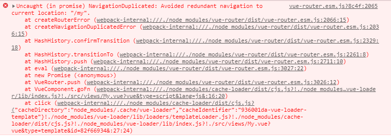

## 前端路由

前端路由：根据不同的url地址，页面上展示不同的内容（根据**url**地址的不同分发到不同的**组件**。）

#### SPA 介绍

> spa 是 single page application 简写，意思是单页面应用程序。Vue 适合开发 spa 类型的项目。

优点：

- 业务场景的切换，性能很好。
- 集中维护一个网站的功能。
- 完全的前后端分离（前后端可以并行开发，提供系统开发效率）

缺点：

- 所有的功能集中的一个页面，依赖的资源是非常多的，加载第一次的时候很慢（首屏加载）
- 业务复杂度很高（解决方案：vue组件、前端路由）

#### 前端路由原理

> 基于 hash 的路由原理（通过地址栏 hash 字符串的改变，去更新页面的内容）
>
> - http://localhost:3000?username=lisi#abc
> - http://localhost:3000?username=lisi#hello
> - 锚点 (hash) 作用：跳转到网页的某一个位置
> - 锚点的变化不会导致浏览器重新向服务器发送一个请求。


## Vue 路由

[vue-router](https://router.vuejs.org/zh/ ) 是基于 vue 的 js 插件，实现了前端路由功能。

下载地址：https://unpkg.com/vue-router/dist/vue-router.js

### 组件分类

vue 文件分为两类，一个是页面组件，一个是复用组件。

- 页面组件：页面展示 - 配合路由用
- 复用组件：展示数据 / 常用于复用

**src/views(或pages) 文件夹下的页面组件，配合路由切换。** 

**src/components 文件夹下的一般引入到 src/views 下的 vue 中复用展示数据。** 

### 基本使用

> 基于 url 地址的变化实现组件的切换。一切都围绕着hash值变化为准。

使用流程：下载路由，编写对应规则注入到vue实例上，使用router-view 挂载点显示切换的路由。

main.js

==导入组件时，可以使用 @ 代替 `./`，@的意思是在src文件夹下找文件。== 

```js
// 引入Router
import VueRouter from 'vue-router'
// 使用路由插件
Vue.use(VueRouter)

// 导入要切换的组件
import Find from './views/Find.vue'
import My from '@views/My.vue'
import Part from '@views/part.vue'

// 创建路由规则数组
const routes = [
  {
    path: "/find",
    component: Find
  },
  {
    path: "/my",
    component: My
  },
  {
    path: "/part",
    component: Part
  }
]

// 创建路由对象，传入规则
const router = new VueRouter({
  routes
})

// 关联到Vue实例
new Vue({
  router,
})
```

App.vue

> `components` 换成 `router-view`，用于组件内容渲染的地方。

```vue
<template>
  <div>
    <div class="footer_wrap">
      <a href="#/find">发现音乐</a>
      <a href="#/my">我的音乐</a>
      <a href="#/part">朋友</a>
    </div>
    <div class="top">
      <router-view></router-view>
    </div>
  </div>
</template>
```


### 声明式导航

vue-router 提供了一个全局组件 `router-link`

- `router-link` 实质上最终会渲染成 a 链接，to 属性等价于提供 href 属性，但是 to 属性不需要加 `#` ，直接写`/组件名` 就可以。

- `router-link` 提供了声明式导航高亮的功能（自带类名）

App.vue

```vue
<template>
  <div>
    <div class="footer_wrap">
      <router-link to="/find">发现音乐</router-link>
      <router-link to="/my">我的音乐</router-link>
      <router-link to="/part">朋友</router-link>
    </div>
    <div class="top">
      <router-view></router-view>
    </div>
  </div>
</template>
```


#### 跳转传参

> 在跳转路由时，给路由组件对应的组件内传值。

在 `router-link` 的 to 属性传值：

- ```vue
  /path?参数名=值
  ```

  /pash/ 值：需要路由对象提前配置 path: “/pash/参数名”

对应页面组件接收传递过来的值：

- ```vue
  $route-query.参数名
  ```

- ```vue
  $route.params.参数名
  ```


##### 语法格式

有 `:` 的路径代表要接收具体的值

App.vue

```vue
<router-link to="/part?name=小传">朋友-小传</router-link>
<router-link to="/part/小智">朋友-小智</router-link>
```

main.js

> 通过 params 传参，要使用路由定义。

```js
// 创建路由规则数组
const routes = [
  {
    path: "/part",
    component: Part
  },
  {
    path: "/part/:username",
    component: Part
  }
]
```

part.vue

```vue
<template>
  <div>
      <p>人名: {{ $route.query.name }} -- {{ $route.params.username }}</p>
  </div>
</template>
```


### 重定向和模式

#### 重定向

> 匹配 path 后，强制切换到目标 path上。

- 网页打开 url 默认 hash 值是 /路径。
- redirect 是设置要重定向到哪个路由路径。

**应用场景：当网站需要一个默认页面时，可以将默认页强制重定向到首页。** 

- **注意：强制重定向后，还会重新匹配一次数组中的规则。** 

```vue
const routes = [
	{
		path: "/",
		redirect: "/find"
	},
]
```


#### 404页面

> 如果路径 hash 值，没有和数组里的规则匹配，则默认给一个 404 页面。

语法：路由最后，path 匹配 * (任意路径) - 前面不匹配就命中最后这个，显示对应组件页面。

```js
const routes = [
  {
    path: "*",
    component: NotFound
  }
]
```

```vue
<router-link to="/404">404</router-link>
```


#### 模式设置

hash路由：http://localhost:8080/#/home

history路由：http://localhost:8080/home（以后上线需要服务器端支持，否则找的是文件夹）

区别：

- hash （url中#后面的部分）虽然出现在 URL 中，但不会被包含在 http 请求中，对后端完全没有影响，因此改变 hash 不会重新加载页面。

- history 利用了 html5 history interface 中新增的 pushState() 和 replaceState() 方法。这两个方法应用于浏览器记录栈

  > hash 路由 和 history 路由一个加 `#`，一个不加 `#`。

main.js

```js
const router = new VueRouter({
  routes,
  mode: "history" // 打包上线后需要后台支持, 模式是 hash
})
```


### 编程式导航

> 用 Js 代码跳转。

```vue
<template>
  <div>
    <span @click="goFn('/find')">发现音乐</span>
    <span @click="goFn('my')">我的音乐</span>
    <span @click="goFn('part')">朋友</span>
  </div>
</template>

<script>
export default {
  methods: {
    goFn(targetPath) {
      this.$router.push({
        path: targetPath,
      })
    }
  }
}
</script>
```

多次点同一个按钮，会报错误：**避免重复导航到当前位置:“/my”。** 

 

解决这个错误，要在 router/index.js 中**重写push方法，忽略报错**。

```js
// 原来的 push
let originPush = VueRouter.prototype.push;
// 重写push方法
VueRouter.prototype.push = function (location) {
  return originPush.call(this, location).catch(err => err);
}
```


#### 跳转传参

name 属性只有在js才会有用，决定跳转到哪里，其他时候选写。

##### 语法格式

> query需要 path 传值，使用path时，会忽略 params参数。
>
> params 需要 name 传值，name支持query 和 params传参。

```js
this.$router.push({
	path: "路由路径",
    query: {
        "参数名": 值
    },
    
    name: "路由名",
    params: {
        "参数名": 值
    }
})

// 对应路由接收参数：$route.params.参数名
// 对应路由接收参数：$route.query.参数名
```

==使用path时，会自动忽略params== 

My.vue

```vue
<template>
  <div>
    <h1>My Music</h1>
    <span @click="goFn('find')">发现音乐-编程式导航</span>
    <br />
    <span @click="goQuery">我的音乐-编程式导航query</span>
    <br />
    <span @click="goParams">朋友-编程式导航params</span>
  </div>
</template>

<script>
export default {
  methods: {
    goFn(targetPath) {
      this.$router.push({
        path: targetPath,
      })
    },
    goQuery () {
      this.$router.push({
        path: 'part',
        query: {
          name: '小传'
        }
      })
    },
    goParams () {
      this.$router.push({
        path: '/part',
        params: {
          username: '小智'
        }
      })
    }
  }
}
</script>
```

part.vue

```vue
<template>
  <div>
      <h4>{{ $route.query.name }} -- {{ $route.params.username }}</h4>
  </div>
</template>
```


### 嵌套和守卫

#### 路由嵌套

> 在一级路由下，嵌套二级路由。

思路：

1. 在子组件中新建 `router-link` 标签，链接二级路由。

2. 在 router/index.js 中的路由规则数组中，给一级路由添加 name 属性和 children 属性。

   > children 属性中和一级路由一样，有路径 (path) 和 组件 (component)。

语法格式：

```js
const routes = [
    // 一级路由1
    {
        path: '/find',
        component: Find,
        name: "Find",
        children: [
            // 二级路由1
            {
                path: '/find/',
                component: Recommend
            },
        ]
    }
]
```


Find.vue

```vue
<template>
	<div>
		<div class="nav_main">
			<router-link to="/find/recommend">推荐</router-link>
			<router-link to="/find/ranking">排行榜</router-link>
			<router-link to="/find/songlist">歌单</router-link>
		</div>

		<div style="1px solid red;">
			<router-view></router-view>
		</div>
	</div>
</template>

<style scoped>
.nav_main {
	background-color: red;
	color: white;
	padding: 10px 0;
}
.nav_main a {
	text-align: center;
	text-decoration: none;
	color: white;
	font-size: 12px;
	margin: 7px 17px 0;
	padding: 0px 15px 2px 15px;
	height: 20px;
	display: inline-block;
	line-height: 20px;
	border-radius: 20px;
}
.nav_main a:hover {
	background-color: brown;
}
.nav_main .router-link-active {
	background-color: brown;
}
</style>
```

router/index.js

> 路由规则数组在一级路由下写 children 属性，代表当前的二级路由。

```js
const routes = [
  {
    path: "/find",
    component: Find,
    // 二级路由
    name: "Find",
    children: [
      {
        path: "recommend",
        component: Recommend
      },
      {
        path: "ranking",
        component: Ranking
      },
      {
        path: "songlist",
        component: SongList
      }
    ]
  },
  // 404: 只需要在一级栏里给一个全局使用
  {
    path: "*",
    component: NotFound
  },
]
```


#### 类名区分

- router-link-exact-active（精确匹配）url 中 hash 值路径，与 href 属性值完全相同，设置此类名。
- router-link-active（模糊匹配）url 中 hash 值，包含 href 属性值这个路径。


#### 全局前置守卫

> 路由跳转之前，先执行前置守卫函数，判断是否可以正常跳转。

语法格式：

```js
router.beforeEach((to, from, next) => {
    if (to.path == '目标页面' && 登录状态 == false) {
        // 未登录执行代码块。
        next(false);	// 阻止跳转
    } else {
        next();		// 已登录，放行
    }
})
```

> 属性：
>
> - to：要跳转的路由。
> - from：从哪里跳转的路由。
> - next：函数体。

应用场景：在跳转路由之前，判断用户是否登录，为登录弹窗提示，登录后跳转到 我的音乐 页面。

```js
const router = new VueRouter({
  routes,
})

// 模拟登录状态
let isLogin = false;

router.beforeEach((to, from, next) => {
    if (to.path == '/find' && isLogin == false) {
        alert('请登录');
        next(false);	// 阻止跳转
    } else {
        next();		// 放行
    }
})
```


### vant 组件库

vant 是一个轻量、可靠的移动端Vue组件库，开箱即用。

官网地址：[https://vant-contrib.gitee.io/vant/#/zh-CN/](https://vant-contrib.gitee.io/vant/#/zh-CN/)

特点：

- 提供60多个高质量组件，覆盖移动端各类场景。
- 性能极佳，组件平均体积不到 1kb。
- 完善的中英文文档实例。
- 支持 Vue2 & Vue3。
- 支持按需引入和主题定制。

#### 全部引入

1. 全部引入，快速开始：[https://vant-contrib.gitee.io/vant/#/zh-CN/quickstart](https://vant-contrib.gitee.io/vant/#/zh-CN/quickstart)
2. 下载vant 组件库到当前项目中。
3. 在 main.js 中全局导入所有组件。
4. 使用按钮组件，作为示范的例子。


#### 方式一：导入所有组件

> Vant 支持一次性导入所有组件，引入所有组件会增加代码包体积，不推荐。

1. 下载 vant 组件

   ```cmd
   yarn add vant -D
   ```

2. 导入所有组件，到 main.js 中

   ```js
   import Vue from 'vue';
   import Vant from 'vant';
   import 'vant/lib/index.css';
   
   Vue.use(Vant);
   ```

3. 使用按钮组件

   [https://vant-contrib.gitee.io/vant/#/zh-CN/button](https://vant-contrib.gitee.io/vant/#/zh-CN/button)

   ```vue
   <van-button type="primary">主要按钮</van-button>
   <van-button type="info">信息按钮</van-button>
   <van-button type="default">默认按钮</van-button>
   <van-button type="warning">警告按钮</van-button>
   <van-button type="danger">危险按钮</van-button>
   ```


#### 方式二：手动按需求引入

> 只引入使用的组件。
>
> 在不使用插件的情况下，可以手动引入需要的组件。

1. 手动单独引入，快速开始：[https://vant-contrib.gitee.io/vant/#/zh-CN/quickstart](https://vant-contrib.gitee.io/vant/#/zh-CN/quickstart)

   ```js
   import Button from 'vant/lib/button';	// button 组件
   import 'vant/lib/button/style';	// button 样式
   ```

2. 注册

   ```js
   components: {
   	VanButton: Button	// 手动注册组件名
   	[Button.name]: Button	// 等价的
   }
   ```

3. 使用

   ```vue
   <van-button type="primary">主要按钮</van-button>
   <van-button type="info">信息按钮</van-button>
   <van-button type="default">默认按钮</van-button>
   <van-button type="warning">警告按钮</van-button>
   <van-button type="danger">危险按钮</van-button>
   ```


#### 方式三：自动按需求引入

> 按需求加载组件。

babel-plugin-import 是一款 babel 插件，他会在编译过程中将import 的写法自动转换为按需求引入的方式。

1. 安装插件

   ```~cmd
   yarn add babel-plugin-import -D
   ```~

2. 在 babel 配置文件里 (babel.config.js)

   ```js
   module.exports = {
     plugins: [
       ['import', {
         libraryName: 'Vant',
         libraryDirectory: 'es',
         style: true
       }, 'vant']
     ]
   }
   ```

3. 全局注册 (main.js)

   ```js
   import Vue from 'vue'
   
   import 'vant/lib/index.css'
   import { Button } from 'vant'
   Vue.use(Button);
   ```


#### 弹出框使用

> 弹出模态框，常用于消息提示、消息确认，或在当前页面内完成特定的交互操作。

[https://vant-contrib.gitee.io/vant/#/zh-CN/dialog](https://vant-contrib.gitee.io/vant/#/zh-CN/dialog)

```vue
<template>
	<div>
    	<van-button type="primary" @click="btn">提示弹窗</van-button>
    </div>
</template>

<script>
    // 导入提示弹窗
    import { Dialog } from "vant";

    export default {
        methods: {
            btn() {
                // 属性
                Dialog({
                    title: '标题',
                    message: "提示",
                    showCancelButton: true
                });
            },
        }
    };
</script>
```

**Dialog 是一个函数，调用后会直接在页面中弹出相应的模态框。** 

Dialog 是一个方法，要在需要使用的组件中导入，不可以在 main.js 中导入。

- title：提示框的标题
- message：提示内容
- showCanceButton：是否带取消按钮。
  - true：带取消按钮，相当于 `Dialog.confirm()` 
  - false：不带取消按钮，相当于 `Dialog.alert()` 


#### 表单使用

>用于数据录入、校验，支持输入框、单选框、复选框、文件上传等类型，需要与 [Field 输入框](https://vant-contrib.gitee.io/vant/#/zh-CN/field) 组件搭配使用。2.5 版本开始支持此组件。

[https://vant-contrib.gitee.io/vant/#/zh-CN/form](https://vant-contrib.gitee.io/vant/#/zh-CN/form)

##### 导包

```js
import { Form, Field } from 'vant'
Vue.use(Form);
Vue.use(Field);
```

##### 语法格式

```vue
<van-form validate-first @failed="onFailed">
    <van-field
		v-model="输入框的值"
		name="表单名字"
		placeholder="表单提示信息"
		:rules="[{ 校验规则, 属性 }]"
	/>
</van-form>
```


##### 校验规则

通过 `rules` 定义表单校验规则。

| 键名               | 说明                                              | 类型                                  |
| :----------------- | :------------------------------------------------ | :------------------------------------ |
| required           | 是否为必选字段                                    | *boolean*                             |
| message `v2.5.3`   | 错误提示文案                                      | *string \| (value, rule) => string*   |
| validator `v2.5.3` | 通过函数进行校验                                  | *(value, rule) => boolean \| Promise* |
| pattern `v2.5.3`   | 通过正则表达式进行校验                            | *RegExp*                              |
| trigger `v2.5.2`   | 本项规则的触发时机，可选值为 `onChange`、`onBlur` | *string*                              |
| formatter `v2.5.3` | 格式化函数，将表单项的值转换后进行校验            | *(value, rule) => any*                |

登录框

```vue
<van-form @submit="onSubmit">
    <van-field
               v-model="username"
               name="username"
               label="username"
               placeholder="用户名"
               :rules="[{ required: true, message: '请填写用户名' }]"
               />
    <van-field
               v-model="password"
               type="password"
               name="password"
               label="password"
               placeholder="密码"
               :rules="[{ required: true, message: '请填写密码' }]"
               />
    <div style="margin: 16px;">
        <van-button round block type="info" native-type="submit">
            提交
        </van-button>
    </div>
</van-form>

<script>
    export default {
        data() {
            return {
                username: '',
                password: '',
            };
        },
        methods: {
            onSubmit(values) {
                console.log('submit', values);
            },
        },
    };
</script>
```


### 跨域

端口不一样，

反向代理解决跨域

> 本地 node 服务器开启 cors，负责请求的转发和数据接收回传。


### 案例：网易云音乐

> 前端请求本地的 node 项目，node 服务器伪装请求去拿网易云音乐服务器数据转发回给自己前端。

#### 第一步：本地接口启动

下载网易云音乐 node 项目接口，在本地启动。

[项目地址](https://binaryify.github.io/NeteaseCloudMusicApi/#/?id=%e5%ae%89%e8%a3%85)  [备用地址](https://github.com/Binaryify/NeteaseCloudMusicApi/tree/master/docs) 

下载完成后安装所有依赖 ( yarn )，在本地启动 ( node app.js )，访问 http://localhost:3000。


#### 第二步：项目初始化

1. 初始化工程

   ```cmd
   vue create music-demo
   ```

2. 下载所需的第三方依赖包

   ```cmd
   yarn add axios vue-router vant
   ```

3. 引入提前准备好的 css 样式，实现样式初始化和适配问题。

   > css文件：<a href="./assets/file/netcaseMusic.style.zip">netcaseMusic.style.zip</a> 

   ```js
   import '@style/reset.css'
   import '@mobile/flexible.js'
   ```

4. vant 自动按需求引入

   文档：[https://vant-contrib.gitee.io/vant/#/zh-CN/quickstart](https://vant-contrib.gitee.io/vant/#/zh-CN/quickstart)

   ```cmd
   yarn add babel-plugin-import  -D
   ```

   在 `babel.config.js` 中配置插件

   ```js
   module.exports = {
     plugins: [
       ['import', {
         libraryName: 'vant',
         libraryDirectory: 'es',
         style: true
       }, 'vant']
     ],
   }
   ```


#### 第三步：需求分析

- 布局页面：src/Layout/index.vue
- 首页 - src/Home/index.vue
- 搜索页：src/Search/index.vue
- 播放页：src/Play/index.vue


#### 第四步：准备路由

- 创建路由：`router/index.js` 

  ```js
  import Vue from "vue";
  import VueRouter from "vue-router";
  Vue.use(VueRouter);
  
  // 导入路由模块
  import Layout from "@/views/Layout";
  import Home from "@/views/Home";
  import Search from "@/views/Search";
  import Play from "@/views/Play";
  
  // 路由表
  const routes = [
  	{
  		path: "/",
  		redirect: "/layout",
  	},
  	{
  		path: "/layout",
  		component: Layout,
  		redirect: "/layout/home",
  		children: [
  			{
  				path: "home",
  				component: Home,
          		// 保存路由对象额外信息
  				meta: {
  					title: "首页",
  				},
  			},
  			{
  				path: "search",
  				component: Search,
  				meta: {
  					title: "搜索",
  				},
  			},
  		],
  	},
  	{
  		path: "/play",
  		component: Play,
  	},
  ];
  
  const router = new VueRouter({
  	routes,
  });
  
  export default router;
  ```

- 在 `main.js` 中导入路由。

  ```js
  // 导入路由
  import router from '@/router'
  
  new Vue({
    router
  })
  ```

- 在 App.vue 中使用 `router-view` 给一级路由占位。

  ```vue
  <template>
    <div>
      <router-view></router-view>
    </div>
  </template>
  ```

- 在 `Layout/index.vue` 中使用 `router-view` 给二级路由占位。

  ```vue
  <template>
    <div>
      <h1> 布局页面 </h1>
      
      <!-- 二级路由占位 -->
      <router-view></router-view>
    </div>
  </template>
  
  <style scoped>
  /* 中间内容区域 - 容器样式(留好上下导航所占位置) */
  .main {
    padding-top: 46px;
    padding-bottom: 50px;
  }
  </style>
  ```


#### 第五步：Layout 布局页面

> 顶部Nav、底部Tab切换。

文档：[https://vant-contrib.gitee.io/vant/#/zh-CN/tabbar](https://vant-contrib.gitee.io/vant/#/zh-CN/tabbar)

- 在 `main.js` 中注册组件。

  ```js
  import { Tabbar, TabbarItem, NavBar } from 'vant';
  Vue.use(Tabbar);
  Vue.use(TabbarItem);
  Vue.use(NavBar);
  ```

- 在 `Layout/index.js` 中使用 TabBar 插件。

  - replace：是否在跳转时替换当前页面历史。

  - 标题切换

    - **通过 `this.$route.meta.title` 获取当前路由上的属性。** 

      ```js
      data() {
          return {
              active: 0,
              title: this.$route.meta.title,
          };
      },
      ```

    - **通过 watch 监听。** 

      ```js
      watch: {
          $route () {
              this.title = this.$route.meta.title;
          }
      }
      ```

  ```vue
  <template>
  <div>
      <!-- NavBar -->
      <van-nav-bar :title="title" />
  
      <!-- 二级路由占位 -->
      <div class="main">
          <router-view></router-view>
      </div>
  
      <!-- 底部Tab按钮 -->
      <van-tabbar v-model="active">
          <!-- replace：是否在跳转时替换当前页面历史 -->
          <van-tabbar-item icon="home-o" replace to="/layout/home">首页</van-tabbar-item>
          <van-tabbar-item icon="search" replace to="/layout/search">搜索</van-tabbar-item>
      </van-tabbar>
      </div>
  </template>
  
  <script>
      export default {
          data() {
              return {
                  active: 0,
                  title: this.$route.meta.title,
              };
          },
          watch: {
              $route () {
                  this.title = this.$route.meta.title;
              }
          }
      };
  </script>
  
  <style scoped>
      .main {
          padding-bottom: 50px;
      }
  </style>
  ```


#### 第六步：网络请求封装

> 封装网络请求方法，方便统一管理。

- 封装 `utils/request.js`，基于axios 进行二次封装，设置基础地址，并对外暴露。

  ```js
  import axios from 'axios'
  axios.defaults.baseURL = "http://localhost:3000"
  export default axios;
  ```

- 在 src 下创建 api 文件夹，用来存放接口。**封装 `src/api/Home.js` ，用于写首页的接口。** 

  > 统一封装网络请求方法。

  ```js
  // 引入二次封装的 axios
  import request from '@/utils/request'
  
  // 接口 - 推荐歌单
  export const recommendMusic = params => request ({
      url: '/personalized',
      params,
  });
  
  // 接口 - 最新音乐
  export const newMusic = parmas => request ({
      url: '/personalized/newsong',
      params,
  });
  
  // 以上封装相当于-------------------------------------
  export const name = function (params) {
      return request({
          url: '接口地址',
          params,
      })
  };
  ```

- 在 src/api 下新建 index.js，**`src/api/index.js`  用于导入所有接口，再统一导出供外部使用。** 

  > 简单理解：==api 目录下，各个请求模块 js，都统一来到 index.js 再向外导出。== 

  ```js
  // 导入所有的接口
  import { recommendMusic, newMusic } from './Home'
  
  // 定义变量，暴露各个接口
  export const recommendMusicAPI = recommendMusic;
  export const newMusicAPI = newMusic;
  ```

- 在 `mian.js` 导入所有接口，进行测试。

  ```js
  // 导入所有接口
  import { recommendMusicAPI, newMusicAPI } from '@/api/index.js'
  
  // 定义方法，调用接口
  async function Fn() {
      const res = await recommendMusicAPI({ limit: 6 });
      comsole.log(res);
  }
  
  Fn();
  ```

  

#### 第七步：首页 - 推荐歌单 - 最新音乐

- > 在 `Home/index.vue` 中写首页的内容。
  >
  > > async - await：以同步的方式写异步的代码。

  ```vue
  <template>
    <div>
      <!-- 推荐歌单 -->
      <p class="title">推荐歌单</p>
      <van-row gutter="6">
        <van-col span="8" v-for="v in reList" :key="v.id">
          <van-image width="100%" height="3rem" fit="cover" :src="v.picUrl" />
          <p class="song_name">{{ v.name }}</p>
        </van-col>
      </van-row>
      <!-- 最新音乐 -->
      <p class="title">最新音乐</p>
      <van-cell center v-for="v in songList" :key="v.id"
                :title="v.name"
                :label="v.song.artists[0].name + ' - ' + v.name">
          <template #right-icon>
            <van-icon name="play-circle-o" size="0.6rem"/>
          </template>
      </van-cell>
    </div>
  </template>
  
  <script>
  // 导入首页用到的接口
  import { recommendMusicAPI, newMusicAPI } from '@api/index.js'
  
  export default {
      data () {
          return {
              // 推荐歌单列表
              reList: [],
              // 最新音乐
              newList: [],
          }
      },
      async created () {
          // 获取接口数据 - 推荐歌单
          const res = await recommendMusicAPI({ limit: 6 });
          this.resList = res.data.result;
          
          // 获取接口数据 - 最新音乐
          const resNew = await newMusicAPI({
              limit: 20
          });
          this.newList = res.data.result;
      }
  }
  </script>
  ```

- 在 `api/index.js` 中导入所有接口，再统一导出供外部使用。

  ```js
  // 导入首页所有接口
  import { recommendMusic, newMusic } from '/Home'
  
  //* 导出所有接口，供外部使用 */
  // 推荐歌单
  export const recommendMusicAPI = recommendMusic;
  // 最新音乐
  export const newMusicAPI = newMusic;
  ```

- >在 `main.js` 中引入共用样式。

  ```js
  // 注册用到的vant组件
  import {Col, Row, VanImage} from 'vant'
  Vue.use(Col);
  Vue.use(Row);
  Vue.use(VanImage);
  ```


#### 第八步：搜索页面

- >在 `Search/index.vue` 中，写搜索页面的内容。

  ```vue
  <template>
  	<div>
      <!-- 搜索框 -->
  		<van-search v-model.trim="value"
                  shape="round"
                  @click="results = []"
                  @input="fn(value)"
                  placeholder="请输入搜索关键词" />
      <!-- 热门关键词 -->
      <div class="search_wrap" v-if="results.length == 0">
        <!-- 标题 -->
        <p class="hot_title">热门搜索</p>
        <!-- 热搜关键词容器 -->
        <div class="hot_name_wrap">
          <!-- 每一个热搜词 -->
          <span class="hot_item"
                v-for="(v, i) in keys" :key="i"
                @click="fn(v.first)">
            {{ v.first }}
          </span>
        </div>
      </div>
  
      <!-- 搜索结果 -->
      <div class="search_wrap" v-else>
        <!-- 标题 -->
        <p class="hot_title">最佳匹配</p>
  
        <van-list
          v-model="loading"
          :finished="finished"
          finished-text="没有更多了"
          @load="onLoad">
          <van-cell v-for="v in results" :key="v.id"
                    :title="v.name"
                    replace to="/play">
            <template #right-icon>
              <van-icon name="play-circle-o" size="0.6rem" />
            </template>
          </van-cell>
        </van-list>
      </div>
  	</div>
  </template>
  
  <script>
  import { hotSearchAPI, searchResultAPI } from '@/api';
  
  export default {
  	data() {
  		return {
  			value: "",
        // 关键字
        keys: [],
        // 搜索结果
        results: [],
        loading: false,
        finished: false,
        page: 1,
  		};
  	},
    async created () {
      // 关键字
      const res = await hotSearchAPI({
        limit: 8,
      })
      this.keys = res.data.result.hots;
      // console.log(res.data.result.hots, '关键字');
    },
    methods: {
      // 搜索结果
      async fn(value) {
        // 重置页码
        this.page = 1;
        // 重置状态
        this.finished = false;
        this.loading = false;
  
        // 替换最新数据
        this.value = value;
  
        // 如果为空，则返回
        if (!this.value) {
          this.results = [];
          return;
        }
  
        const res = await this.handleSearch();
        this.results = res.data.result.songs;
        // console.log(res.data.result.songs, '搜索结果');
      },
  
      // 加载更多数据
      async onLoad () {
        // 页面自增1
        ++this.page;
  
        const res = await this.handleSearch();
  
        // 数据加载完毕，接口返回undefined，更改触底数据
        if (!res.data.result.songs) {
          this.finished = true;
          return;
        }
  
        this.results = [...this.results, ...res.data.result.songs];
        // console.log(this.results, 'this.results');
  
        // 触底后，继续加载下一次的数据
        this.loading = false;
      },
  
      // 返回数据
      async handleSearch () {
        return await searchResultAPI({
          limit: 30,
          keywords: this.value,
          offset: (this.page - 1) * 30,
        })
      }
    }
  };
  </script>
  
  <style scoped>
  /* 搜索容器的样式 */
  .search_wrap {
  	padding: 0.266667rem;
  }
  
  /*热门搜索文字标题样式 */
  .hot_title {
  	font-size: 0.32rem;
  	color: #666;
  }
  
  /* 热搜词_容器 */
  .hot_name_wrap {
  	margin: 0.266667rem 0;
  }
  
  /* 热搜词_样式 */
  .hot_item {
  	display: inline-block;
  	height: 0.853333rem;
  	margin-right: 0.213333rem;
  	margin-bottom: 0.213333rem;
  	padding: 0 0.373333rem;
  	font-size: 0.373333rem;
  	line-height: 0.853333rem;
  	color: #333;
  	border-color: #d3d4da;
  	border-radius: 0.853333rem;
  	border: 1px solid #d3d4da;
  }
  </style>
  ```

- > 在 `api/Search.js` 中创建搜索页要用到的所有接口。

  ```js
  // 引入二次封装的 axios
  import request from '@/utils/request.js'
  
  // 接口 - 搜索热词
  export const hotSearch = () => request({
      url: '/search/hot',
  })
  
  // 接口 - 搜索结果列表
  export const searchResult = params => request({
      url: '/cloudsearch',
      params,
  })
  ```

- 在 `api/index.js` 中导入所有接口，并导出。

  ```js
  // 导入搜索页所有的接口
  import { hotSearch, searchResult } from '/Serach'
  
  //* 导出所有接口，供外部使用 */
  // 请求热搜关键字
  export const hotSearchAPI = hotSearch;
  // 搜索结果列表
  export const searchResultAPI = searchResult;
  ```

- 在 `main.js` 中引入样式。

  ```js
  import { Badge, Search, Icon } from 'vant'
  Vue.use(Badge);
  Vue.use(Search);
  Vue.use(Icon);
  ```

  

#### 第九步：播放页面

```vue
```


#### 第十步：postcss 适配所有设备

1. 下载 postcss、postcss-pxtorem

   ```cmd
   yarn add postcss postcss-pxtorem
   ```

2. 在 src 平级目录下，新建 postcss.config.js 配置文件。

   ```js
   module.exports = {
     plugins: {
       'postcss-pxtorem': {
         // 能够把所有元素的px单位转成Rem
         // rootValue: 转换px的基准值。
         // 例如一个元素宽是75px，则换成rem之后就是2rem。
         rootValue: 37.5,
         propList: ['*']
       }
     }
   }
   ```

   


